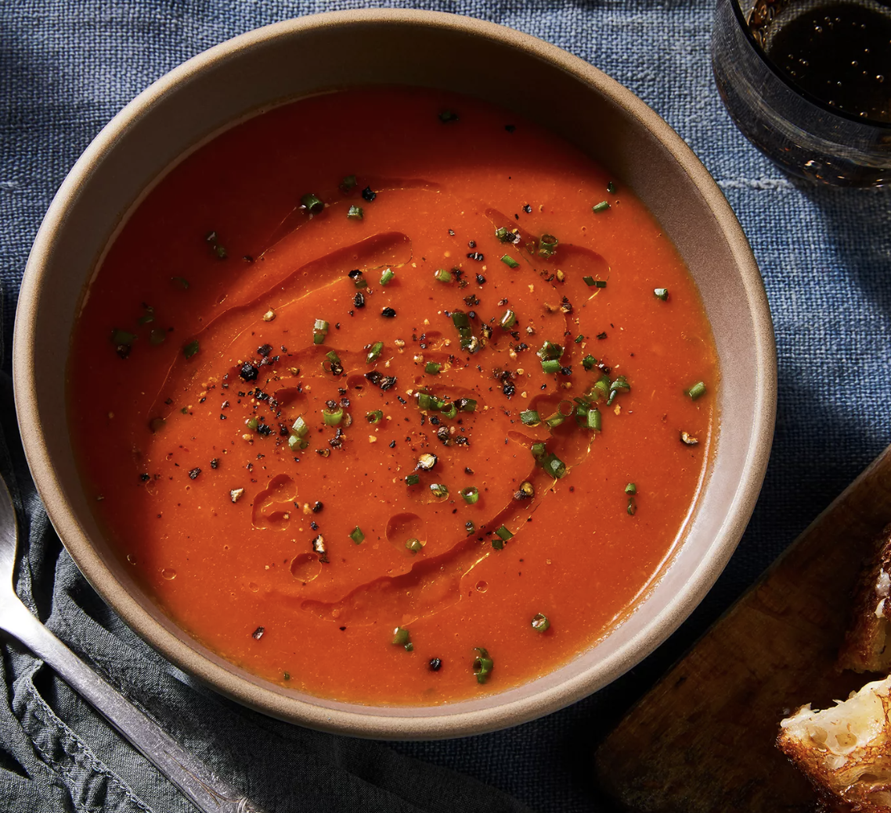

###### *RELATED* : 
---

---
## PREP | COMMENTS

---
# INGREDIENTS

- [ ] 1/2 cup extra-virgin olive oil, divided
- [ ] 2 cloves garlic, grated on a microplane grater
- [ ] 1 small onion, finely sliced (about 1 cup)
- [ ] 1 teaspoon dried oregano
- [ ] 1/2 teaspoon red pepper flakes
- [ ] 2 slices white bread, crusts removed, torn into rough 1/2-inch pieces
- [ ] 2 (28-ounce) cans whole peeled tomatoes packed in juice
- [ ] Kosher salt and freshly ground black pepper
- [ ] Minced chives, basil, or parsley as garnish
- [ ] Bread or grilled cheese for serving

---
# INSTRUCTIONS

1. Heat 2 tablespoons of olive oil in a large saucepan over medium high heat until shimmering. Add the garlic, onions, oregano, and red pepper flakes. Cook, stirring frequently until onions are softened but not browned, about 4 minutes. Add the bread and tomatoes. Roughly mash the tomatoes with a potato masher or whisk (alternatively, you can break up the tomatoes with your hands before adding to the pot). Add 2 cups water. Bring to a boil over high heat, then reduce to a simmer. Cook for 5 minutes.
2. Transfer half of soup to the jar of a blender. Blend soup, starting at low speed and gradually increasing to high (be careful starting up, it can shoot out the top of the blender—open the vent and hold a kitchen towel over the lid to prevent blowout). With blender running on high, gradually trickle in half of remaining olive oil. (Alternatively, you can do all of this in the pot with an immersion blender, though the soup might not be quite as smooth.) Season soup to taste with salt and pepper. Transfer to a large bowl and repeat with remaining half of soup and olive oil. Ladle into individual serving bowls, top with minced herbs, drizzle with more olive oil, and serve with bread or grilled cheese.

---
## NOTES

---
## TIPS

---
## NUTRITIONS

---
### *EXTRA* :

