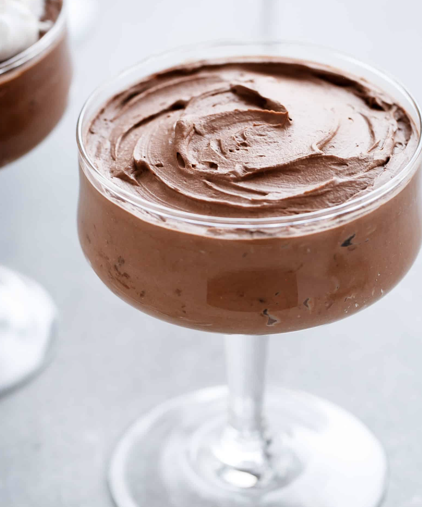

###### *RELATED* : 
---
Rich Chocolate Mousse in minutes! No eggs. No dairy. And only 3 ingredients to thick, creamy and rich chocolate mousse that happens to be low carb and real really good for you. **Weight Watchers:** 5pp per serve (out of 8 serves)

---
## PREP

---
# INGREDIENTS

- 2 x 400ml (13.7oz) cans full fat coconut cream or coconut milk *See Notes
    
- 2 tablespoons confectioners sweetener (or confectioners | icing sugar if not counting carbs)
    
- 3 tablespoons unsweetened cocoa powder
    
- pinch of salt (optional! About 1/4 teaspoon. Adjust to your tastes)
    
- 20 g | 2 squares 70% chocolate , shaved (optional for extra richness -- or sugar free chocolate chips)
    
- extra shaved chocolate to garnish

---
# INSTRUCTIONS

1. Place sealed cans of coconut cream (or milk) in the refrigerator overnight. Without shaking the cans, open carefully and scoop out the thick cream sitting at the top above the water. Transfer the thick hard cream to a bowl and discard all of the liquid left in the bottom of the cans (or reserve to add into smoothies later).
    
2. Add the sweetener (or sugar if using) and beat on high using a hand mixer (or whisk) until thick and creamy (about 1-2 minutes). Reserve about 4 tablespoons of the plain 'whipped cream' to use as a topping to serve with and set aside.
    
3. Fold the cocoa powder and salt through the cream and beat (or whisk) again until smooth, well combined and thick. Fold through the shaved chocolate if using). Depending on the coconut milk you use, a mousse will form almost immediately once the cocoa powder is mixed through. If not, refrigerate until set and ready to serve, or serve immediately. Dollop the 'plain whipped cream' over the mousse and sprinkle with shaved chocolate (if using).

---
## NUTRITIONS

Calories: 334kcal | Carbohydrates: 5g | Protein: 3g | Fat: 31g | Saturated Fat: 28g | Sodium: 4mg | Potassium: 353mg | Fiber: 2g | Vitamin C: 2.8mg | Calcium: 13mg | Iron: 2.5mg

---
## NOTES

*I found coconut cream worked the best, but you can use coconut milk. Do not try to use light or reduced fat. You need the fat content in both the cream and/or milk to make the cream successfully or it may not work.

---
## TIPS

---
### *EXTRA* :

