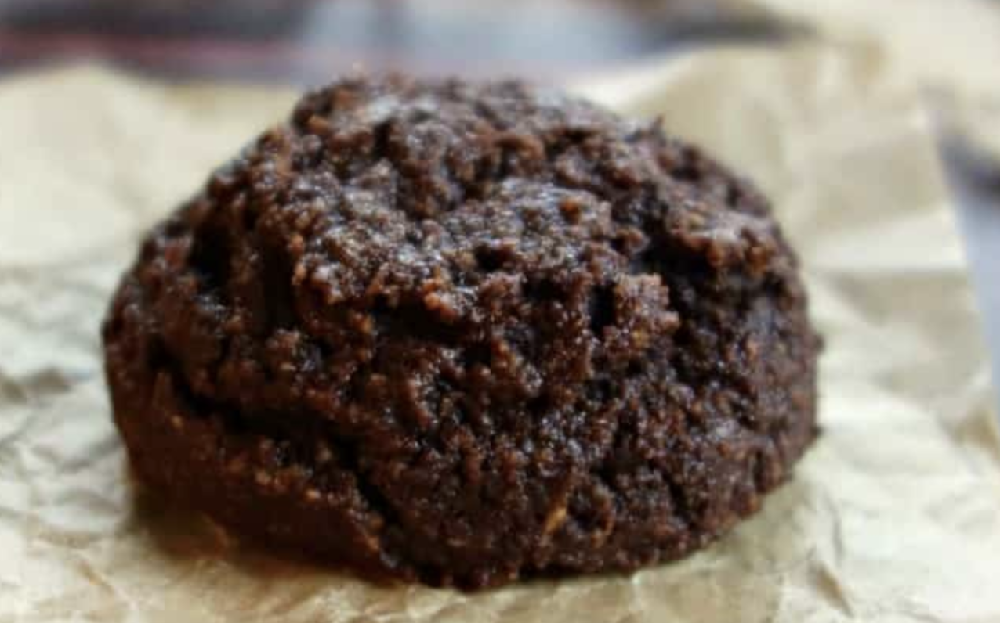
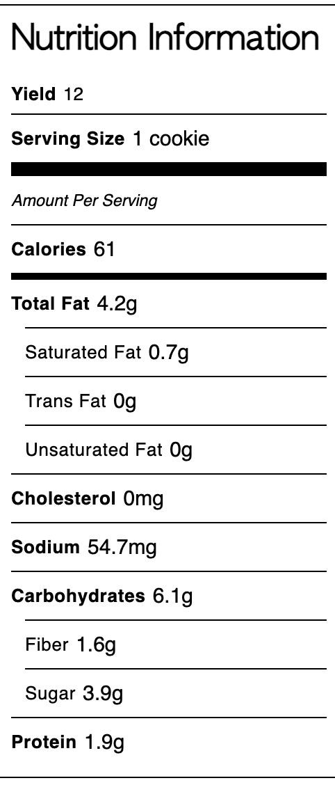

## NOTES

_4-ingredient chocolate [almond flour](https://www.amazon.com/gp/product/B07L9Q45HG/ref=as_li_tl?ie=UTF8&tag=powerhungry0f-20&camp=1789&creative=9325&linkCode=as2&creativeASIN=B07L9Q45HG&linkId=636b9729cf6c8dab32b91de8c2e6badf) cookies that are rich, decadent, and good for you! They are vegan, oil-free, grain-free, Paleo, & only 61 calories per cookie_

## PREP

# INGREDIENTS

3/4 cup (84 g) blanched almond flour  

1/3 cup (37 g) unsweetened cocoa powder

3 and 1/2 tablespoons (32 g) coconut palm sugar (see notes for options) (J'ai mis un peu moins de 1/2 t. pour 2 recettes)

3/4 teaspoon baking powder

1/4 teaspoon fine sea salt

1/4 cup (60 mL) water

# INSTRUCTIONS

  
. Preheat the oven to 350F. Line a baking sheet with parchment paper.

. In a medium bowl, whisk the almond flour, cocoa powder, coconut sugar, baking powder and salt (breaking up all lumps in the flour and cocoa powder). Add the water and stir until blended.

. Drop by tablespoons (I used a small cookie scoop) on the prepared baking sheet, spacing 2 inches apart.

. Bake in the preheated oven for 12 to 14 minutes until the tops appear dry (& are beginning to crack a bit) and are set at the centers.

. Remove from the oven and cool for 10 minutes on the baking sheet. Transfer cookies to a cooling rack and cool completely.

## TIPS

