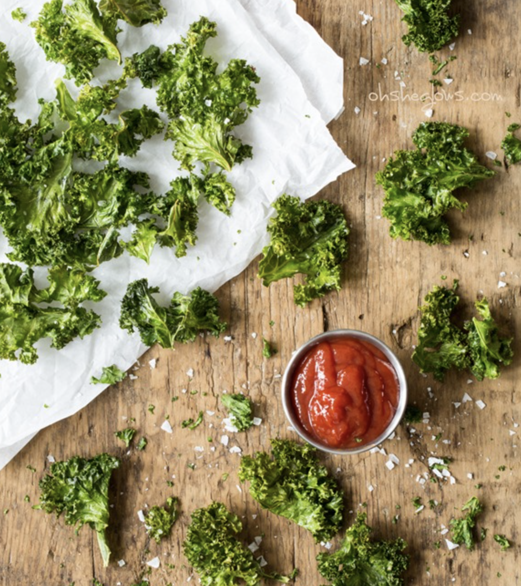

###### *RELATED* : 
---

---
## PREP | COMMENTS

---
# INGREDIENTS

##### **PER BAKING SHEET:**

- [ ] approx. 1/2 bunch kale leaves
- [ ] 1/2 tablespoon extra virgin olive oil or melted coconut oil
- [ ] 1.5 tablespoons nutritional yeast
- [ ] 1 teaspoon garlic powder
- [ ] 3/4 teaspoon chili powder
- [ ] 1/2 teaspoon onion powder
- [ ] 1/2 teaspoon smoked paprika
- [ ] 1/4 teaspoon fine grain sea salt or pink Himalayan sea salt
- [ ] 1/8 teaspoon cayenne pepper (optional)

---
# INSTRUCTIONS

1. Preheat oven to 300F. Line a large rimmed baking sheet with parchment paper.
    
2. Remove leaves from the stems of the kale and roughly tear it up into large pieces. Compost the stems (or freeze for smoothies). Wash and spin the leaves until thoroughly dry.
    
3. Add kale leaves into a large bowl. Massage in the oil until all the nooks and crannies are coated in oil. Now sprinkle on the spices/seasonings and toss to combine.
    
4. Spread out the kale onto the prepared baking sheet into a single layer, being sure not to overcrowd the kale.
    
5. Bake for 10 minutes, rotate the pan, and bake for another 12-15 minutes more until the kale begins to firm up. The kale will look shrunken, but this is normal. I bake for 25 mins. total in my oven.
    
6. Cool the kale on the sheet for 3 minutes before digging in! This really makes all the difference! Enjoy immediately as they lose their crispiness with time.
    
7. Repeat this process for the other half of the bunch.

---
## NOTES

---
## TIPS

Feel free to make these in a dehydrator if you have one. You can also experiment with the convection or dehydrator setting on your oven (if applicable).

---
## NUTRITIONS

Serving Size 1 of 2 servings | Calories 60 calories | Total Fat 3.5 grams  
Saturated Fat 0.5 grams | Sodium 260 milligrams | Total Carbohydrates 6 grams  
Fiber 1 grams | Sugar 0 grams | Protein 2 grams

---
### *EXTRA* :

