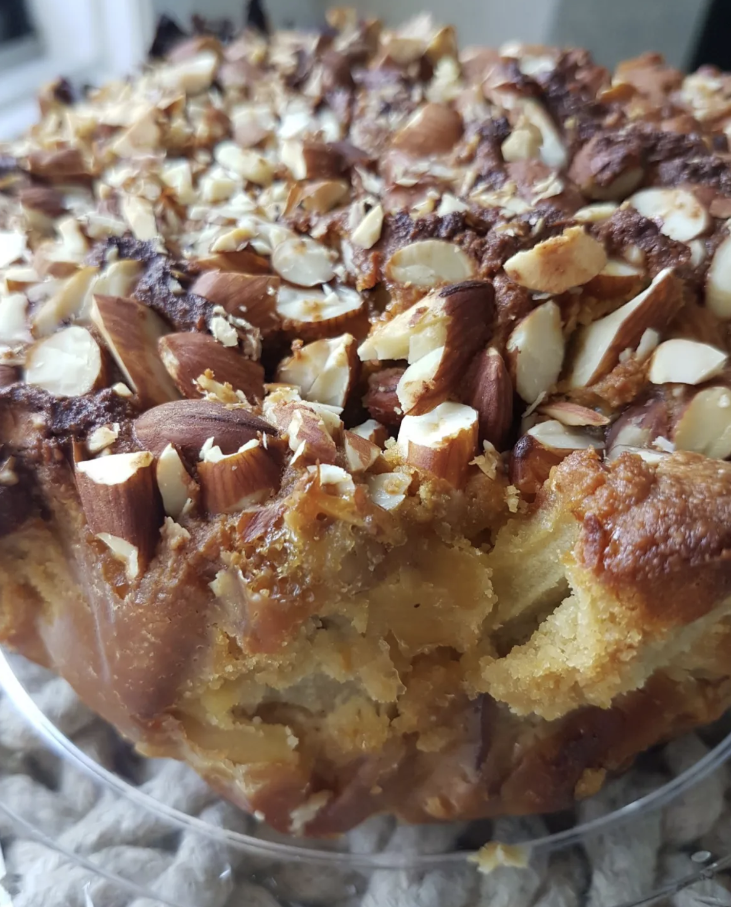

###### *RELATED* : 
---

---
## PREP

---
# INGREDIENTS

- [ ] 2 cups almond flour or crushed almonds,  
- [ ] 1 tsp baking powder,  
- [ ] ¼ cup of olive oil,  
- [ ] ¼ c up honey,  
- [ ] 1 tsp of vanilla,  
- [ ] 2 eggs,  
- [ ] Zest of an orange,  
- [ ] 2 apples, diced,  
- [ ] Almond chips to decorate.

---
# INSTRUCTIONS

1. Preheat oven to 320F.  
2. Mix all ingredients except apples and almonds.  
3. Add the apples to the mixture and incorporate them well.  
4. Pour everything into a 20 cm baking tin that you have wrapped beforehand in parchment paper.  
5. Garnish with the almond chips.  
6. Bake 60 to 80 minutes – check after 45min to make sure the cake is still ok.  
7. Let stand for 30min.

---
## NOTES

---
## TIPS

---
## NUTRITIONS

---
### *EXTRA* :

