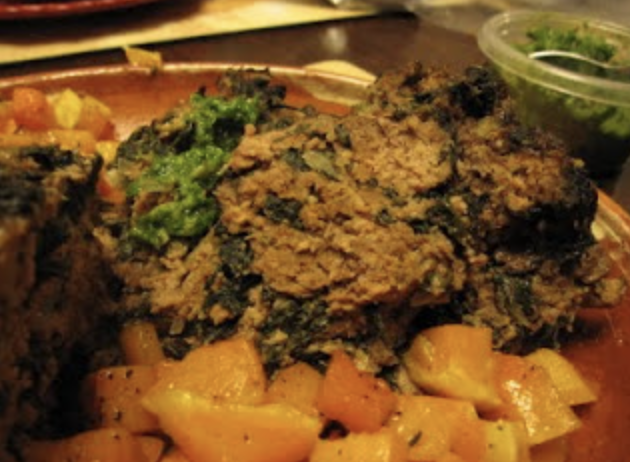

## PREP

**  
Hands-on time**: 10 minutes

**Baking time**: 55 minutes or so

**Resting time:** 10 minutes to reabsorb the juices

# INGREDIENTS

2 tbsp olive oil

1 onion finely chopped

1 bunch spinach, stemmed, washed and coarsely chopped or 1 package frozen spinach, thawed in the microwave or in a little boiling water **_[Marise: moi j’ai utilisé des épinards frais]_**

2lb/1kg ground beef

2/3 cup bread crumbs [I used Panko, the magazine suggested fresh] **_[Marise : moi j’ai utilisé du pain frais - congelé puis décongelé - sans gluten coupé en petits morceaux sans la croûte]_**

1 beaten egg

1 tbsp coarse sea salt **[Marise: attention j’ai trouvé que c’était un peu trop]**

1 tsp chili powder 

Freshly ground pepper

.

**Chimichurri Sauce**: **_[Marise: une demie recette du chimichurri serait probablement suffisant]_**

3 cups Italian/flat leaf parsley leaves

1 large shallot, finely chopped

1 large clove garlic, finely chopped

1/3 cup good olive oil

2 tbsp red wine vinegar

½ - 1 tsp dried oregano (I prefer the Greek variety)

Pinch of chili powder

Sea salt & freshly ground black pepper to taste

# INSTRUCTIONS

1. Preheat the oven to 350°F/170°C.

  

2. Heat olive oil in a large skillet over medium heat. Add the onion and cook until softened (5 minutes or so). Increase the heat and add the spinach…if you are using frozen, drain the thawed spinach, firmly pressing out any extra liquid. Continue cooking until the spinach is wilted (only applies if using fresh) or heated through. Make sure all the liquid has evaporated. Set aside to cool.

  

3. In a large bowl, mix the ground beef, bread crumbs and cooled spinach mixture. In a separate bowl, whisk the egg with salt, chili powder and pepper. Add to the meat mixture and combine well. 

Take a spoonful of the mixture and flatten into a patty. Cook the patty in a non stick pan so you can taste and check the seasoning.

Pack the meat mixture into a 5-cup, (1.25l), loaf pan, mounding in the center. 

  

4. Place on a rimmed baking sheet and bake for about 55 minutes or until the meatloaf shrinks from the sides of the pan and the juices just run clear.

Remove from the oven and set aside to rest for 10 minutes before slicing.

  

5. Meanwhile, to make the Chimichurri sauce, in your food processor drop the peeled shallot, garlic and the parsley leaves to the bowl and process until the parsley is finely chopped. Add the remaining ingredients, pulse a few times to combine and taste for seasoning. Transfer the sauce to a small bowl to be served with the meatloaf.

## NUTRITIONS

## NOTES

The amount of chili powder you add will be determined how spicy you like your food. As is, it's quite mild. I actually doubled the amount of chili powder for our tastes. **_(Marise: moi j’en ai mis un peu moins que la recette demande)_**

## TIPS

### *EXTRA*

