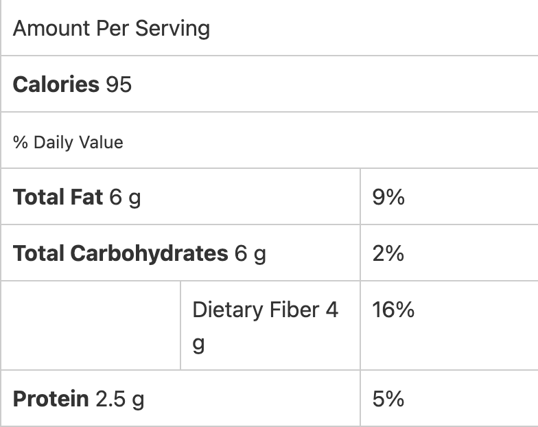

###### *RELATED* : 

## PREP

# INGREDIENTS

1 ripe avocado
  
3 cups organic baby **[kale](http://drjockers.com/2013/02/kale-chips-recipe/)**
  
2 cups organic fresh or dried basil
  
1 cup organic fresh or dried thyme
  
6 garlic cloves
  
1 cup water
  
1/4 cup raw **[lemon juice](http://amzn.to/2kAuNWG)**
  
1 tsp. **[real salt](http://amzn.to/2kEOewU)**
  
1/2 tsp. **[black pepper](http://amzn.to/2jMuGaK)**

# INSTRUCTIONS

**Step #1:** Blend in a **[blender](http://drjockers.com/what-is-the-best-vegetable-juicer/)**.

**Step #2:** Serve over **[raw zucchini noodles](http://drjockers.com/supercharged-zucchini-noodles/)** or **[shiratki noodles](http://amzn.to/2usazkt)** or on a raw salad.
  
**Step #3:** Enjoy!

## NUTRITIONS

Serving Size 1/4 cup

* Percent Daily Values are based on a 2,000 calorie diet. Your daily values may be higher or lower depending on your calorie needs.

## NOTES

## TIPS

### *EXTRA*

