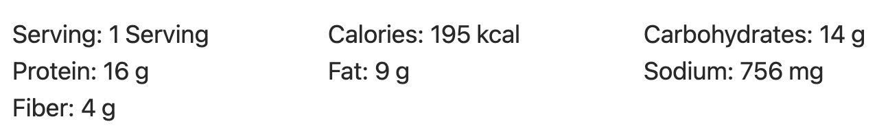

This fast and easy Beef and Cabbage Stir Fry is a filling low carb dinner with big flavor and endless possibilities for customization.

## PREP

# INGREDIENTS

STIR FRY SAUCE

2 Tbsp soy sauce $0.18

1 Tbsp toasted sesame oil $0.33

1 Tbsp  (en mettre la moitié) sriracha* $0.05 

½ Tbsp brown sugar $0.02 (palm sugar)

Essai 22 sept. 1/2c. thé curcuma

  

STIR FRY

½ head small green cabbage $1.78

essai avec des (**bettes 2 petites)** aussi et bon et aussi un **1/2 oignon** 

2 carrots $0.22

3 green onions $0.17 (ou 1 gros oignon)

½ Tbsp neutral cooking oil $0.02

½ lb. lean ground beef $3.90

2 cloves garlic $0.16

1 Tbsp fresh grated ginger $0.13

Pinch of salt and pepper $0.05

  

GARNISHES (optional)

1 Tbsp sesame seeds $0.08

1 Tbsp sriracha $0.05

# INSTRUCTIONS

Prepare the stir fry sauce first. In a small bowl stir together the soy sauce, toasted sesame oil, sriracha, and brown sugar. Set the sauce aside.

Shred the vegetables so they are ready to go when you need them. Cut one small cabbage in half, remove the core, and then finely shred the leaves of one half the cabbage (4-6 cups once shredded, save the other half for another recipe). Peel two carrots, then use a cheese grater to shred them (1 cup shredded). Slice three green onions. Mince two cloves of garlic. Peel a knob of ginger using either a vegetable peeler or by scraping with the side of a spoon, then grate it using a small-holed cheese grater.

Heat a large skillet over medium heat. Once hot add the cooking oil, ground beef, garlic, ginger, and a pinch of salt and pepper. Cook the beef until browned (about five minutes).

Add the cabbage and carrots to the skillet and continue to stir and cook until the cabbage is slightly wilted (or fully wilted, if you prefer). Stir in the prepared sauce and the green onions. Top with a sprinkle of sesame seeds and a drizzle of sriracha, then serve.

## NUTRITIONS

## NOTES

* 1 Tbsp sriracha makes a medium-spicy stir fry. If you don't like spicy, I'd start with 1 tsp. The sriracha adds flavor as well as heat, so I don't suggest skipping it all together.

### [SEND THIS TO LOUISE FRENCH VERSION]
[[FRENCH VERSION - SAUTE DE CHOU ET BOEUF]]

## TIPS

### *EXTRA*

