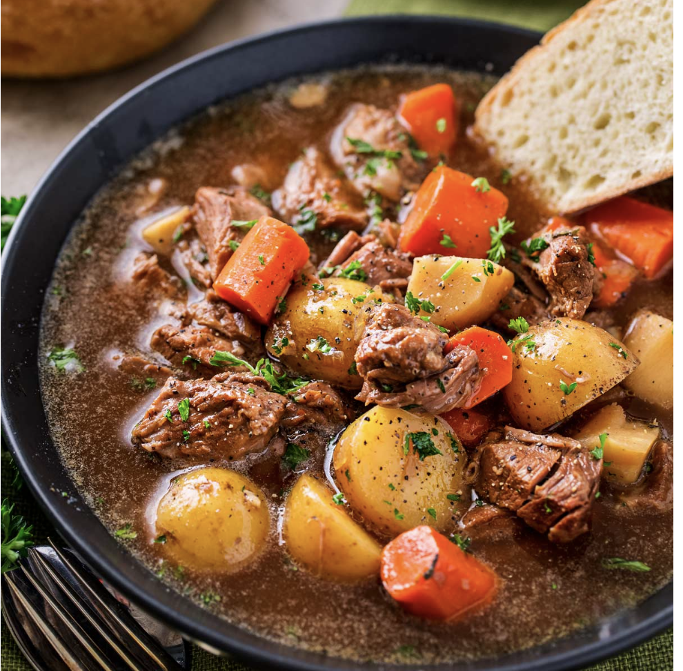

**This horseradish beef stew with beer is the definition of pure comfort food!  Cooking it in the slow cooker makes the beef and veggies super tender with a rich, silky sauce… and it takes hardly any effort to make!  Come home to a mouthwatering dinner, ready to eat!**

## PREP

# INGREDIENTS

2 - 2 1/2 lbs boneless chuck roast, trimmed and cut into 1-2         inch pieces

1 1/2 tsp kosher salt

1 tsp black pepper

2 Tbsp vegetable oil

12 oz dark stout beer (I usually use Guinness)

3 cups beef broth

3 carrots, peeled and cut into 2 inch pieces

2 parsnips, peeled and cut into 1 inch pieces

1 1/4 lb baby Yukon gold potatoes, halved or quartered

1 yellow onion, diced

5 cloves garlic, minced

2 tsp fresh sage, minced

2 Tbsp beef base (better than bouillon)

2 Tbsp tomato paste

1-2 Tbsp prepared horseradish

1 Tbsp softened butter

1 Tbsp all purpose flour

# INSTRUCTIONS

Season beef pieces with 1 1/2 tsp kosher salt and 1 tsp black pepper.  Heat vegetable oil in a large skillet over MED-HIGH heat until shimmering, then add beef in a single layer (you may have to do this in batches to avoid overcrowding the pan).  Brown on all sides, about 1-2 minutes per side, then turn off heat.  Remove beef to slow cooker.


Pour beer and broth into hot pan and stir to loosen any browned bits.  Let sit for a few minutes while you add other ingredients.

Add carrots, parsnips, potatoes, onion, garlic, sage, beef base and tomato paste to slow cooker with the browned beef.  Pour beer/broth mixture from the skillet into the slow cooker.  Cover and cook on LOW for 7 - 7 1/2 hours.

Mix together butter and flour to form a pasty ball.  Remove lid, add horseradish and butter/flour mixture, stirring well.  Cover and continue cooking another 20-30 minutes, stirring occasionally.  Taste, and add additional salt and pepper as needed.

Sprinkle with fresh parsley and serve!































Pour beer and broth into hot pan and stir to loosen any browned bits.  Let sit for a few minutes while you add other ingredients.


Add carrots, parsnips, potatoes, onion, garlic, sage, beef base and tomato paste to slow cooker with the browned beef.  Pour beer/broth mixture from the skillet into the slow cooker.  Cover and cook on LOW for 7 - 7 1/2 hours.


Mix together butter and flour to form a pasty ball.  Remove lid, add horseradish and butter/flour mixture, stirring well.  Cover and continue cooking another 20-30 minutes, stirring occasionally.  Taste, and add additional salt and pepper as needed.


Sprinkle with fresh parsley and serve!

## NUTRITIONS

## NOTES

## TIPS

### Chef Tips

If your stew gets a lot of fat particles at the top after cooking, either skim it with a spoon or remove beef and veggies to a bowl, then pour liquid through a strainer into the bowl with the beef and veggies.

### *EXTRA*

