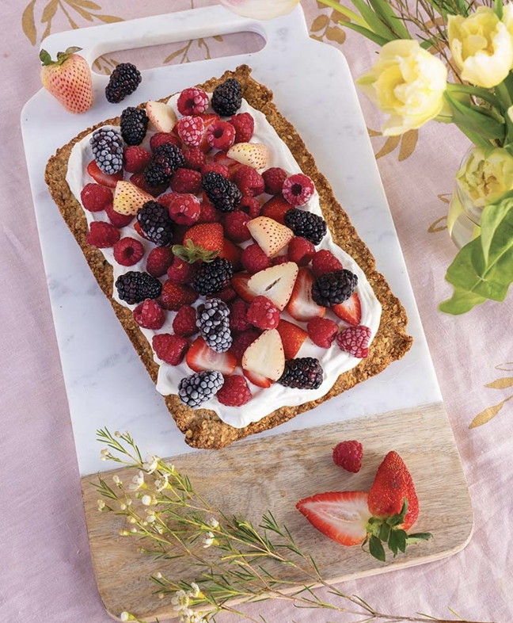

###### *RELATED* : 
---
One giant berry-and-oat crumb bar, jooshed up with rich vanilla yogurt. There’s no rolling of pastry here, making this minimalist dessert a cinch to whip up.

---
## PREP

---
# INGREDIENTS

#### **Crust**
    
- [ ] 2/3 cup (160 mL) coconut oil or unsalted butter, melted, plus more for pan
- [ ] 1 3/4 cups (435 mL) quick-cooking rolled oats
- [ ] 1 1/4 cups (310 mL) spelt flour or gluten-free all-purpose flour
- [ ] 1/2 cup (125 mL) dark brown sugar
- [ ] 1/2 tsp (2 mL) salt
    
#### **Topping**

- [ ] 2 cups (500 mL) plain skyr, thick Greek yogurt, or thick coconut yogurt 
- [ ] 2 Tbsp (30 mL) honey
- [ ] 1 tsp (5 mL) vanilla extract
- [ ] 2 cups (500 mL) berries such as sliced strawberries, raspberries, or a combination

- If mom just can’t get enough chocolate, add 2 to 3 Tbsp (30 to 45 mL) cocoa powder, sifted, to yogurt mixture plus an additional 1 Tbsp (15 mL) honey, and top each slice with grated dark chocolate.

---
# INSTRUCTIONS

1. Preheat oven to 375 F (190 C). Line 9 x 13 in (33 x 23 cm) pan with parchment paper, leaving an overhang for easy removal, and grease parchment with a bit of additional coconut oil. If you intend to transport and serve in the pan, simply grease pan with a bit of additional coconut oil.
2. For crust, in large bowl, combine oats, flour, sugar, and salt; then stir in melted coconut oil to incorporate. The mixture should hold together when squished between your hands. Spelt flour tends to vary in absorbency, so water may be needed to bind crust; if this is the case, add water, 1 Tbsp (15 mL) at a time, until crust holds together tightly. Press crust firmly into prepared pan and bake for 20 to 30 minutes, until crust is dry to the touch and beginning to brown around edges. Remove from oven and cool completely in pan. If you intend to transport tart, leave cooled crust in pan for assembly and serving. Alternatively, using parchment paper, remove crust from pan and place on rectangular serving plate.
3. For topping assembly, in medium bowl, whisk to combine skyr or yogurt, honey, and vanilla. Spread yogurt mixture over cooled crust, leaving a small border. Cover and chill in refrigerator until ready to serve, at least 1 hour and up to 3 hours—the time in the fridge makes for a softened crust that’s easier to cut and eat.
4. When ready to enjoy, top with berries, slice, and serve.

---
## NOTES

---
## TIPS

---
## NUTRITIONS

---
### *EXTRA* :

