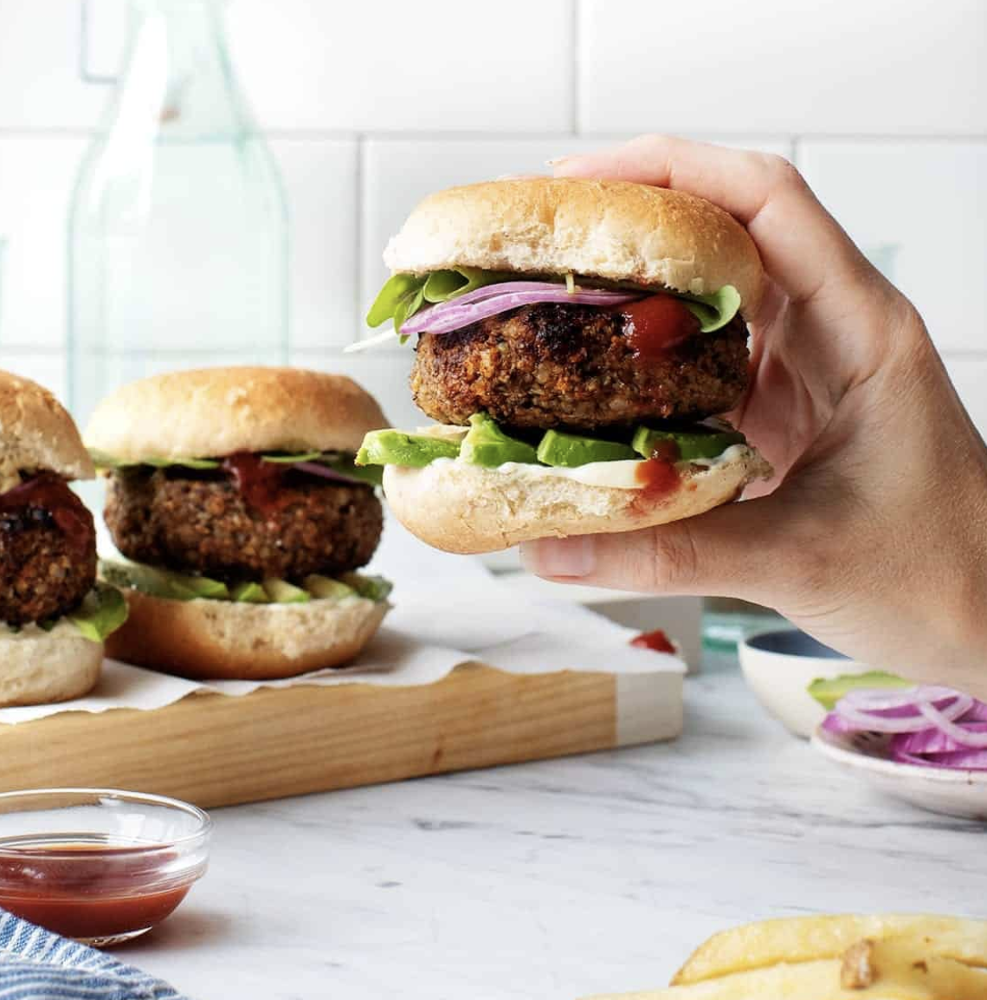

###### *RELATED* : 
---
The best Veggie Burger Recipe! These are tangy, smoky, savory, and have a hearty texture from walnuts and mushrooms.

---
## PREP | COMMENTS

Prep time 20 mins
Cook time 20 mins
Total time 40 mins

---
# INGREDIENTS

- [ ] - 2 tablespoons extra-virgin olive oil, more for drizzling
- [ ] 2 shallots, chopped (⅔ cup)
- [ ] 16 ounces mushrooms, mix of shiitake + portobello, stemmed and diced
- [ ] 2 tablespoons tamari
- [ ] 2 tablespoons balsamic vinegar
- [ ] 1 tablespoon mirin, or ½ teaspoon maple syrup
- [ ] 2 garlic cloves, minced
- [ ] ½ teaspoon smoked paprika
- [ ] 2 teaspoons sriracha, more if desired
- [ ] ½ cup chopped walnuts
- [ ] ¼ cup ground flaxseed
- [ ] 2 cups [cooked short-grain brown rice](https://www.loveandlemons.com/how-to-cook-brown-rice/), freshly cooked so that it’s sticky*
- [ ] 1 cup panko bread crumbs, divided
- [ ] Vegan Worcestershire sauce, for brushing
- [ ] Nonstick cooking spray, for grilling
- [ ] Hamburger buns & desired burger fixings
- [ ] Sea salt and freshly ground black pepper

---
# INSTRUCTIONS

1. Heat the olive oil in a medium skillet over medium heat. Add the shallot and sauté until soft, 1 minute. Add the mushrooms and a generous pinch of salt, and sauté until soft and browned, 6 to 9 minutes, turning down the heat slightly, as needed.
2. Stir in the tamari, vinegar, and mirin. Stir, reduce the heat, then add the garlic, smoked paprika, and sriracha. Remove the pan from the heat and let cool slightly.
3. In a food processor, combine the sautéed mushrooms, walnuts, flaxseed, brown rice, and ½ cup of the panko. Pulse until just combined. The mixture should hold together when pinched, but it should still have some texture.
4. Transfer to a large bowl and fold in the remaining panko.
5. Form into 8 patties, place them on a large plate and chill in the fridge for 1 hour.
6. If you're grilling the patties, preheat a grill to medium-high heat. Brush the patties with olive oil and spray the grill with cooking spray. Place the patties on the grill and use a spatula to press down lightly. Grill for 7 minutes on the first side, flip, and grill for 6 to 7 minutes on the second side, or until well-charred and cooked through.
7. Alternately, cook the patties on the stove. Heat a cast-iron skillet over medium heat. Coat the bottom of the skillet with oil and cook the patties for 5 to 6 minutes per side, or until well-charred and cooked through.
8. Remove from the heat, brush with Worcestershire sauce, and serve with desired fixings.

---
## NOTES

The patties can be made in advance and stored in the fridge, on a tray, until ready to grill. They can also be grilled in advance and stored in the fridge for 3 to 4 days - they reheat surprisingly well.

You can also freeze the cooked burgers. Allow them to cool completely after cooking. Transfer them to an airtight container or bag, and freeze them for up to 3 months. Thaw frozen burgers in the microwave, or warm them in a 400° oven for 10-20 minutes, until heated through.

*It’s very very important that your brown rice is freshly made and sticky so that the burgers will be cohesive. (Long grain rice isn't as sticky, so be sure to get short grain rice).

---
## TIPS

---
## NUTRITIONS

---
### *EXTRA* :

