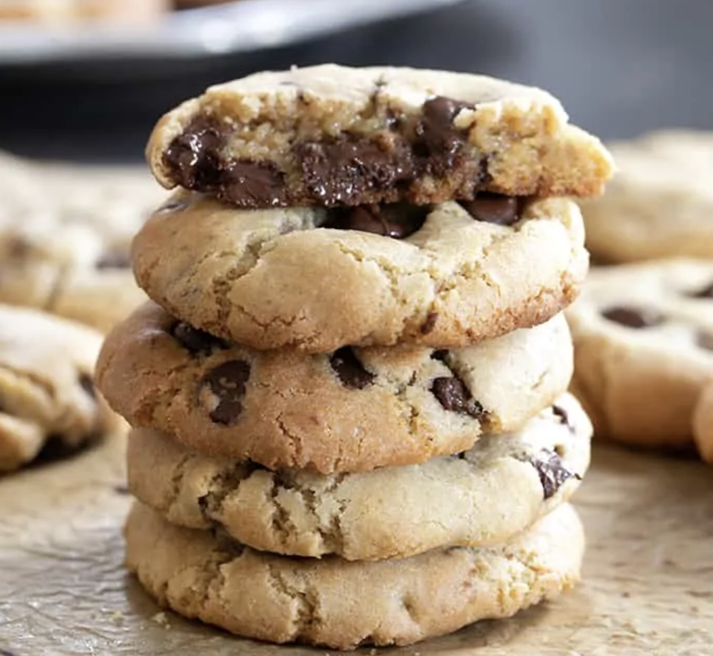

## NOTES

Très bons mais aussi très sucrés

## PREP

# INGREDIENTS

2 1/4 cups (315 g) all purpose gluten free flour (I use Better Batter, but my Better Than Cup4Cup blend works well, too)

1 teaspoon xanthan gum (omit if your flour blend already contains it)

1/2 teaspoon kosher salt

1 teaspoon baking soda

3/4 cup (150 g) granulated sugar

3/4 cup (164 g) packed light brown sugar

8 tablespoons (112 g) unsalted butter, at room temperature

2 eggs (100 g, weighed out of shell) at room temperature, beaten

1 tablespoon pure vanilla extract

12 to 16 ounces semisweet chocolate chips

# INSTRUCTIONS

Preheat your oven to 350°F. Line rimmed baking sheets with unbleached parchment paper and set them aside.

        In a large bowl, place the flour, xanthan gum, salt, baking soda and granulated sugar, and whisk to combine well. Add the brown sugar, and whisk again to combine, working out any lumps in the brown sugar. Create a well in the center of the dry ingredients, and add the butter, eggs, and vanilla, and mix until well-combined. You can use a stand mixer fitted with the paddle attachment to make quick work of it. Add 12 ounces of chocolate chips and mix until evenly distributed throughout the cookie dough. The cookie dough will be thick but not stiff. Add more chocolate chips if you like, and mix thoroughly.

        Divide the cookie dough into 21 portions (or 24 if you’ve used all 16 ounces of chips), and roll each tightly into a ball about 1 1/2 inches in diameter (and about 50 grams each). Press each of the balls of dough into a disk about 1/2-inch thick and place about 2 inches apart on the prepared baking sheets. As you’re rolling the dough, add a few more chocolate chips to each ball, if desired, and roll them into the dough. To ensure the thickest cookies, place the baking sheet in the freezer for 5 minutes, or until the dough is cold.

        Remove the chilled dough from the freezer and place the baking sheets, one at a time, in the center of the preheated oven. Bake until the cookies are golden brown around the edges, light golden brown all over and set in the center (about 12 minutes). Remove from the oven and allow the cookies to cool on the baking sheet for about 5 minutes or until firm before transferring to a wire rack to cool completely.

### NUTRITION

Calories: 220kcal | Carbohydrates: 31g | Protein: 2g | Fat: 10g | Saturated Fat: 6g | Polyunsaturated Fat: 0.4g | Monounsaturated Fat: 3g | Trans Fat: 0.2g | Cholesterol: 25mg | Sodium: 114mg | Potassium: 97mg | Fiber: 2g | Sugar: 18g | Vitamin A: 144IU | Calcium: 18mg | Iron: 1mg

## TIPS

