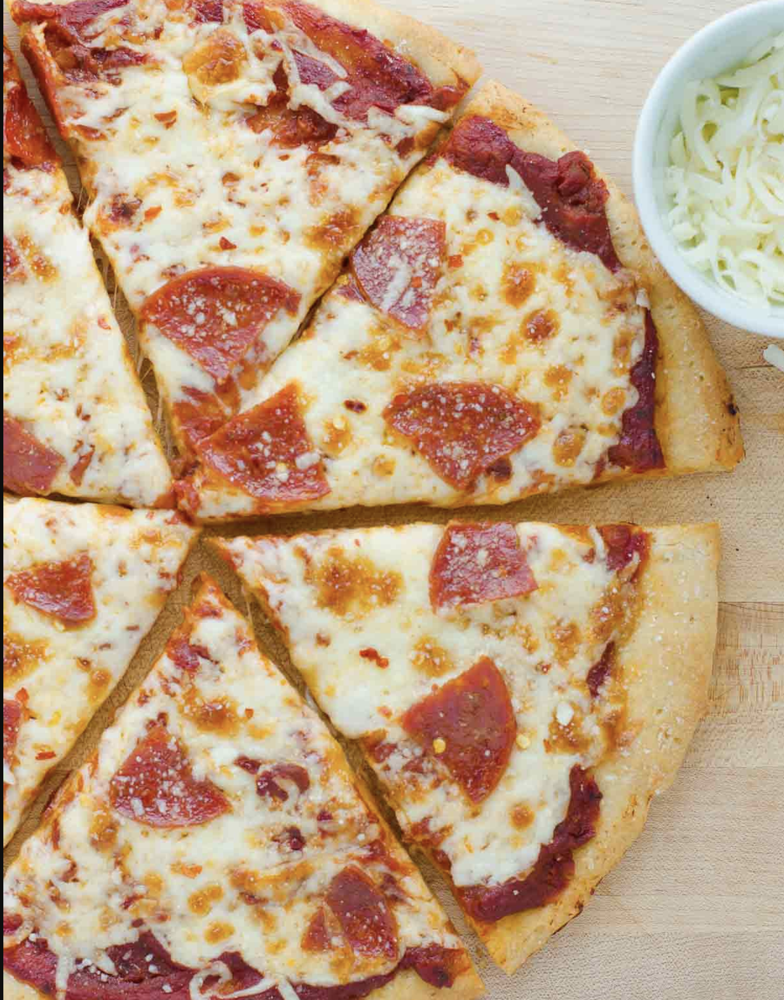

###### *RELATED* : 
---
_The only gluten-free pizza crust recipe you’ll ever need! Easy to make and works with basically any gluten-free flour blend. Bakes up chewy and crispy!_

Hundreds of reviewers agree this recipe makes the best gluten-free pizza crust ever!

---
## PREP | COMMENTS

Prep: 30 mins Cook: 35 mins Total: 1 hr 5 mins
Servings: 2 servings (1 12-inch Pizza)

---
# INGREDIENTS

- [ ] 1 cup warm water, about 110F
- [ ] 1 tablespoon sugar or honey
- [ ] 1 1/2 teaspoons instant yeast
- [ ] 1 1/4 cups Gluten-Free 1:1 Baking Flour + 1/4 cup almond flour,(210 grams)
- [ ] 1 teaspoon baking powder
- [ ] 3/4 teaspoon salt
- [ ] 1 tablespoon psyllium husk powder
- [ ] 2 tablespoons olive oil

---
# INSTRUCTIONS

1. Combine the warm water, sugar, and yeast in a glass measuring cup. Whisk to combine.
2. While the yeast is proofing for 3-4 minutes, combine the flour, baking powder, salt, and psyllium husk powder in the bowl of a stand mixer.
3. With the mixer running on low, slowly add the yeast mixture and oil. Increase the speed to medium-high and beat for 3-4 minutes.
4. Using an oiled spatula, press the dough off the sides into a ball. Cover and let rise for 30 minutes.
5. Preheat the oven to 425F. Oil a 12-inch round pizza pan. Using oiled or wet hands, press the dough into the pan. The dough will shrink slightly as it bake, so press the dough as thin as you can to cover the pan. Let rise for another 10 minutes.
6. Bake for 15-20 minutes. Remove from the oven and add your desired toppings. Bake for another 10-15 minutes depending on your toppings. Let cool for a few minutes before slicing. Enjoy!

---
## NOTES

MAKE IT NUT-FREE: Substitute 1/4 cup of gluten-free all-purpose flour for the almond flour.
  
MAKE IT VEGAN: Use sugar in place of the honey.
  
I have also like this crust made with 1 3/4 my grain-free flour blend. It will bake up with a darker color, but has a delicious flavor and texture. (Note: My blend already contains almond flour so you don't need to add any.)

- One thing I’ve noticed at a lot of restaurants that serve gluten-free pizza is that the pizza never gets crispy on the bottom. _Gluten-free things generally need to be baked longer than regular baked goods._
- With this recipe I _parbake the crust for 15-20 minute before adding the toppings_. Then bake it for another 10-15 minute with the toppings on and you’ll have perfectly crispy, chewy pizza!
- I bake the pizza on [these pans](https://www.amazon.com/gp/product/B000Q3F060/ref=as_li_tl?ie=UTF8&camp=1789&creative=9325&creativeASIN=B000Q3F060&linkCode=as2&tag=meanieats04-20&linkId=TFI5MYC5F4GQCVOC), then transfer it to a wooden cutting board to slice up. Any cookie sheet will work but **I _recommend greasing the sheet with shortening (not olive oil) so it doesn’t stick._** You can also use parchment paper if you prefer.
- Another great thing about this crust recipe is that _it works with basically any gluten-free flour blend_. It turns out wonderfully with King Arthur Flour and Bob’s Red Mill gluten-free flours. You can use what you have on hand

**TO FREEZE**: You cannot freeze the dough, but the parbaked crusts freeze great! I love making an extra crust and freezing it for later when I make this recipe. Follow all the instructions up to where you bake the crust for the first 15-20 minutes. Bake the crust for the first 15-20 minutes then cool completely.

**DOUGH CONSISTENCY**: Your dough might be more runny depending on what gluten-free flour blend you use. All gluten-free flour blends are slightly different and even how you measure the flour can cause differences. See the video above to get a visual on the texture you’re going for.

The dough should be more like cookie dough than runny batter. I would suggest mixing the dough for 3-4 minutes first, then adding more flour if needed (just a little at a time!) to thicken it up slightly.

---
## TIPS

This recipe is really versatile and works with basically any gluten-free flour blend. I like adding a little almond flour when I use a store-bought blend because it gives the crust great flavor and color. If eat nut-free, you can substitute the almond flour with 1/4 GF Baking flour. I've had great results using gluten-free flour from both King Arthur Flour and Bob's Red Mill!

---
## NUTRITIONS

Calories: 443kcal | Carbohydrates: 69g | Protein: 11g | Fat: 17g | Saturated Fat: 2g | Sodium: 885mg | Potassium: 287mg | Fiber: 13g | Sugar: 8g | Calcium: 137mg | Iron: 3.1mg

---
### *EXTRA* :

