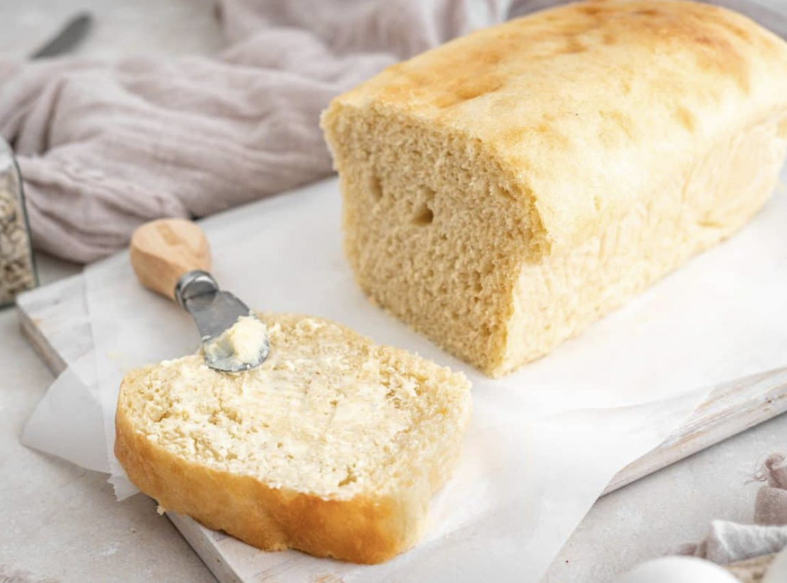
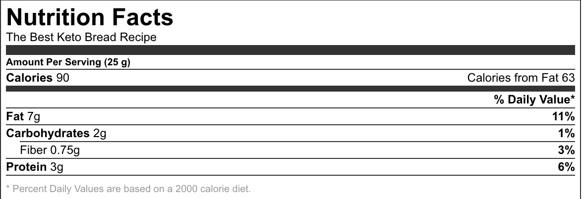

###### *RELATED* : 
---
A simple keto bread recipe that has become a staple in our house. Just a handful of ingredients is all you need.

---
## PREP | COMMENTS

PREP TIME: 10 MINUTESCOOK TIME: 30 MINUTESTOTAL TIME: 40 MINUTES SERVINGS: 20 SLICES

---
# INGREDIENTS

- [ ] 1 1/2 Cup Almond Flour
- [ ] 6 Large eggs Separated
- [ ] 1/4 cup Butter melted
- [ ] 3 tsp Baking powder
- [ ] 1/4 tsp Cream of Tartar It's ok if you don't have this
- [ ] 1 pinch Pink Himalayan Salt
- [ ] 6 drops Liquid Stevia optional

---
# INSTRUCTIONS

1. Preheat oven to 375.
2. Separate the egg whites from the yolks. Add Cream of Tartar to the whites and beat until soft peaks are achieved.
3. In a food processor combine the egg yolks, 1/3 of the beaten egg whites, melted butter, almond flour, baking powder and salt (Adding ~6 drops of liquid stevia to the batter can help reduce the mild egg taste). Mix until combined. This will be a lumpy thick dough until the whites are added.
4. Add the remaining 2/3 of the egg whites and gently process until fully incorporated. Be careful not to overmix as this is what gives the bread it's volume!
5. Pour mixture into a buttered 8x4 loaf pan. Bake for 30 minutes. Check with a toothpick to ensure the bread is cooked through. Enjoy! 1 loaf makes 20 slices.

---
## NOTES

---
## TIPS

---
## NUTRITIONS

---
### *EXTRA* :

