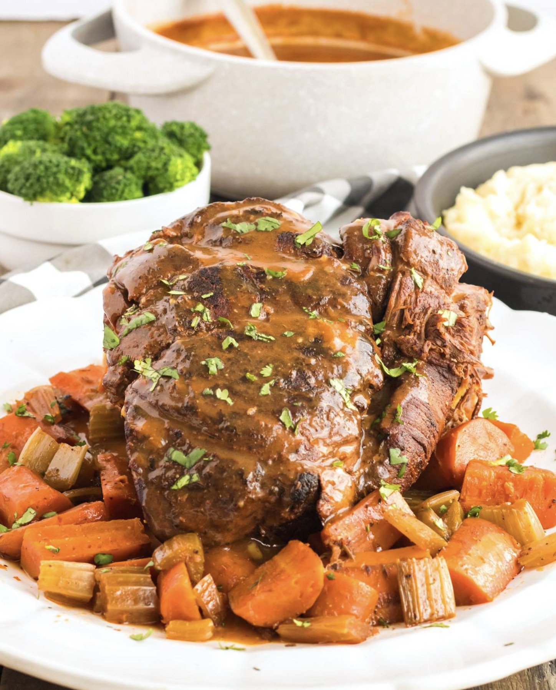

Consistently rated the BEST slow cooker pot roast EVER!

## PREP

# INGREDIENTS

- 4 pound beef round roast or chuck (depending on how lean you prefer it)
- 2 tablespoons [oil (use one with a high smoke point - I use avocado oil)](https://www.amazon.com/gp/product/B00RBTKRA6?ie=UTF8&tag=thedargou09-20&camp=1789&linkCode=xm2&creativeASIN=B00RBTKRA6&th=1)
- 2 carrots , roughly chopped
- 2 ribs celery , roughly chopped
- 1 yellow onion , diced
- 2 cloves garlic , minced
- 2 strips bacon , cut in half
- 2 1/2 cups beef broth
- 1/2 cup dry red wine (optional but highly recommended; can substitute more beef broth)
- 2 tablespoons [tomato paste](https://www.amazon.com/gp/product/B01GGWB6RG?ie=UTF8&tag=thedargou09-20&camp=1789&linkCode=xm2&creativeASIN=B01GGWB6RG)
- 3/4 teaspoon salt
- 2 bay leaves
- For the Dry Rub:
- 2 tablespoons [sweet paprika](https://www.amazon.com/gp/product/B00WU1OCWO?ie=UTF8&tag=thedargou09-20&camp=1789&linkCode=xm2&creativeASIN=B00WU1OCWO)
- 1 teaspoon garlic powder
- 1 1/2 teaspoons salt
- 3/4 teaspoon freshly ground black pepper
- 1/4 teaspoon rosemary
- 1/4 teaspoon thyme
- 1/4 teaspoon oregano
- 1/4 teaspoon basil
- 1/4 teaspoon parsley
- For the Gravy Slurry:
- 5 tablespoons all-purpose flour mixed into a slurry with 1/2 cup beef broth

# INSTRUCTIONS

- Combine all the ingredients for the dry rub together in a bowl. Rub down the roast on all sides with the dry rub. Heat the oil in a Dutch oven or other heavy pot over high heat and liberally brown the roast on all sides. Place the roast in the slow cooker.
    
- Add the broth to the pot, return to a boil, and whisk to loosen up the browned bits. Add the tomato paste, wine, and salt and whisk to combine.
    
- Place the carrots, celery, onion, garlic, and bay leaves in the slow cooker around and on top of the roast. Lay the strips of bacon alongside and on top of the roast. Pour the beef broth/tomato paste mixture over everything.
    
    Cook on low setting for 8-9 hours or on high for 4-5 hours (or until the beef is fork tender). If you have the time we recommend the low setting for the most flavorful and tender beef.
    
- Pour the liquid from the slow cooker into a medium stock pot, leaving the roast and vegetables in the warm slow cooker. Bring to a boil and whisk in the gravy slurry and continue whisking until the gravy is thickened. Season with salt and pepper.
    
- Place the pot roast on a serving platter and spoon the vegetables around it. Discard the bay leaves and bacon (or chop up the bacon and return it to the veggies) . Pour a little gravy over it and serve with gravy on the side along with potatoes and your choice of sides.

## NUTRITIONS

Serving: 0.5pounds | Calories: 495kcal | Carbohydrates: 8g | Protein: 64g | Fat: 19g | Saturated Fat: 6g | Cholesterol: 180mg | Sodium: 1092mg | Potassium: 690mg | Fiber: 1g | Sugar: 1g | Vitamin A: 970IU | Vitamin C: 2.5mg | Calcium: 32mg | Iron: 6.3mg

## NOTES

## TIPS

### *EXTRA*

