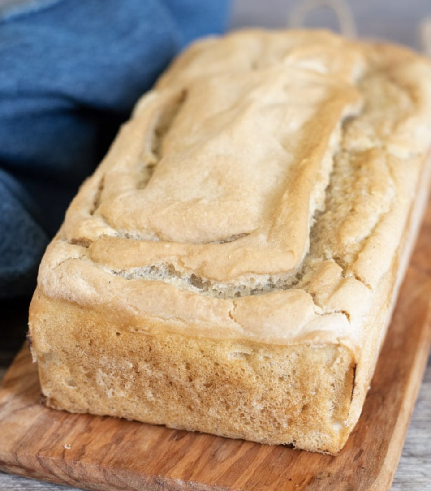

###### *RELATED* : 
---
This easy **gluten free sourdough bread recipe** is made from my sourdough starter recipe, and it is so easy to make you will be surprised it is gluten free! Making your first gluten-free sourdough starter is a bit of work, but it is well worth the effort!

---
## PREP | COMMENTS

PREP TIME15minutes mins
COOK TIME45minutes mins
RISE TIME12hours hrs
TOTAL TIME13hours hrs

---
# INGREDIENTS

- [ ] 2 cups gluten free flour blend * see note
- [ ] 1 teaspoon kosher salt
- [ ] ½ cup sourdough starter
- [ ] water by feel

---
# INSTRUCTIONS

1. Please read the post because it is loaded with tips from me and readers. It is impossible to put them all in this recipe card.
2. Put dry ingredients into a bowl and whisk together.
3. Add water and sourdough starter.
4. You want a dough that is wet like pancake batter.
5. Let the dough rise for 12-24 hours at room temperature.
6. Put some aside to be used as your starter for another time.
7. Put in a greased loaf pan and bake at 350-400 for one hour.
8. Cool completely before slicing.

---
## NOTES

1. Read the entire post. You will miss a lot of tips and tricks in making this recipe a huge success.
2. Use a flour blend that works well with yeast. I like to use Cup4Cup, Pillsbury, or Jules GF Blend. Many readers have successfully used Bob's 1:1 and King Arthur's Measure for Measure.
3. Note this is a recipe that came from Sadie at Bread Srsly. She has lots of tips in the article as well as 100s of reader comments filled with tips.

---
## TIPS

Please know that every gluten free flour blend has a different starch to grain ratio. If you use a blend I didn't test, you may need to adjust your moisture levels in your baked goods.

---
## NUTRITIONS

Serving: 1sliceCalories: 76kcalCarbohydrates: 16gProtein: 2gFat: 1gPolyunsaturated Fat: 0.1gMonounsaturated Fat: 0.1gSodium: 194mgPotassium: 0.04mgFiber: 2gSugar: 1gCalcium: 13mgIron: 1mg

---
### *EXTRA* :

