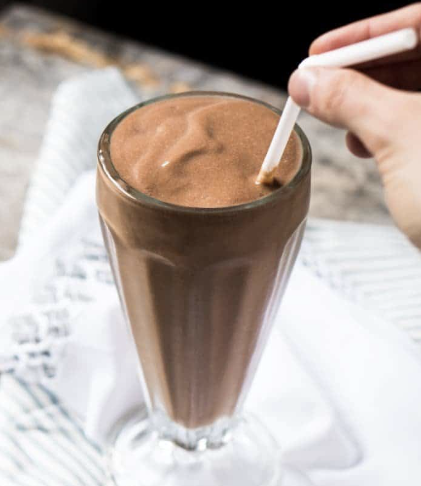

###### *RELATED* : 
---
 **Ultra refreshing**, **thick, creamy** and **absolutely delicious**, this instant paleo and keto chocolate milkshake totally tastes like ice cream! i.e. it’s bound to have you swooning!

---
## PREP

---
# INGREDIENTS

- 1/2 cup **[full-fat coconut milk](https://amzn.to/2IG1URJ)** or heavy cream 
    
- 1/2 mediumavocado to taste
    
- 1-2 tablespoons**[cacao powder](https://amzn.to/2HdHKi2)** to taste 
    
- 1/2 teaspoon**[vanilla extract](http://amzn.to/2gVTsV4)**
    
- pinch **[pink Himalayan salt](https://amzn.to/2Hc0jmy)** or salt of choice
    
- 2-4 tablespoons**[Swerve](http://amzn.to/2x1a1qg)** or sweetener of choice, to taste
    
- 1/2 cup ice as needed
    
- water as needed
    
#### OPTIONAL ADD-INS

- **[chia seeds](https://amzn.to/2JkYgNE)** ground (you'll need to add more water)
    
- **[MCT oil](https://amzn.to/2HdHAaq)**
    
- **[hemp hearts](https://amzn.to/2H1tCdV)**
    
- **[collagen peptides](https://amzn.to/2IsXzAQ)**
    
- **[mint extract](http://amzn.to/2p6tT4v)** or extract of choice

---
# INSTRUCTIONS

1. Add coconut milk, avocado, cacao powder, vanilla extract, salt, sweetener and add-ins of choice to a blender (bullets work amazing here!). Blend until creamy smooth, using a little water as needed.  
    
2. Add in ice and blend until thick and creamy. Do not over-blend, or you'll lose thickness and coldness. Enjoy right away!

---
## NUTRITIONS

Calories: 303kcal | Carbohydrates: 10.75g | Protein: 3g | Fat: 31g | Saturated Fat: 22g | Sodium: 18mg | Potassium: 491mg | Fiber: 5.5g | Vitamin A: 75IU | Vitamin C: 6.1mg | Calcium: 26mg | Iron: 4mg

---
## NOTES

Please note that nutrition facts were estimated using 50g of avocado (about half a medium one).

To break down the carb count for you: 4.5g (3.5g fiber) from 50g avocado + 3g (2g fiber) from 1TBS cacao + 3g from 1/2 cup coconut milk + 0.25g of vanilla extract  = 10.75g total - 5.5 = **5.25g net**.

---
## TIPS

---
### *EXTRA* :

