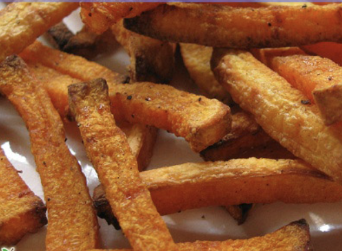
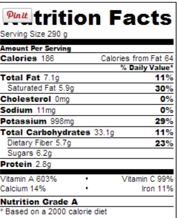

###### *RELATED* : 
---

---
## PREP | COMMENTS

---
# INGREDIENTS

- [ ] 2 tablespoons coconut oil
- [ ] salt and pepper to taste
- [ ] One butternut squash

---
# INSTRUCTIONS

1. Preheat oven to 450 F
2. Use a vegetable peeler to peel the squash.
3. Cut the neck off and slice into fries (all as uniform as possible)
4. Seed the bulb and also cut into fries
5. Melt coconut oil in a large bowl, add salt and pepper, mix fries until coated
6. Place fries onto a cooling rack that is on top of a cookie sheet, no touching
7. Cook for 30-40 minutes depending on thickness
8. Crack oven open for another 10-15 min to add extra crispness.

---
## NOTES

---
## TIPS

---
## NUTRITIONS

---
### *EXTRA* :

