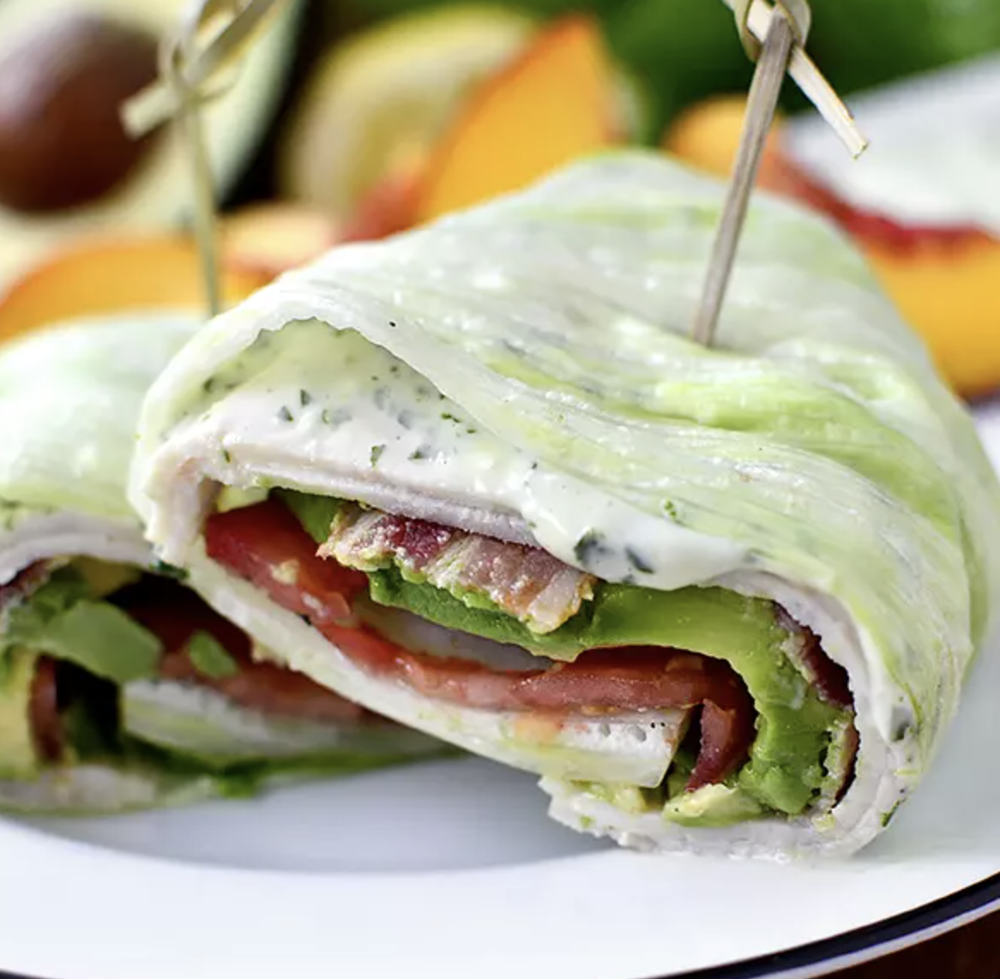

###### *RELATED* : 
---
These California Turkey and Bacon Lettuce Wraps are just what I’ve been looking for, for quick lunches and dinners – they’re not only fresh, but filling and satisfying too. Enjoy, and have a great week!

---
## PREP | COMMENTS

---
# INGREDIENTS

- [ ] 1 head iceberg lettuce
- [ ] 4 slices gluten-free deli turkey (I like Applegate Farms)
- [ ] 4 slices gluten-free bacon, cooked (I like Applegate Farms)
- [ ] 1 avocado, thinly sliced
- [ ] 1 roma tomato, thinly sliced

#### For the Basil-Mayo:

- [ ] 1/2 cup gluten-free mayonnaise (I like Hellmann's Olive Oil Mayo)
- [ ] 6 large basil leaves, torn
- [ ] 1 teaspoon lemon juice
- [ ] 1 garlic clove, chopped
- [ ] salt
- [ ] pepper

---
# INSTRUCTIONS

1. For the Basil-Mayo: combine ingredients in a small food processor then process until smooth. Alternatively, mince basil and garlic then whisk all ingredients together. Can be done a couple days a head of time.
2. Lay out two large lettuce leaves then layer on 1 slice of turkey and slather with Basil-Mayo. Layer on a second slice of turkey followed by the bacon, and a few slices of both avocado and tomato. Season lightly with salt and pepper then fold the bottom up, the sides in, and roll like a burrito. Slice in half then serve cold

---
## NOTES

- If eating more than an hour after packing, pack elements separately then assemble just before eating.

---
## TIPS

---
## NUTRITIONS

---
### *EXTRA* :

