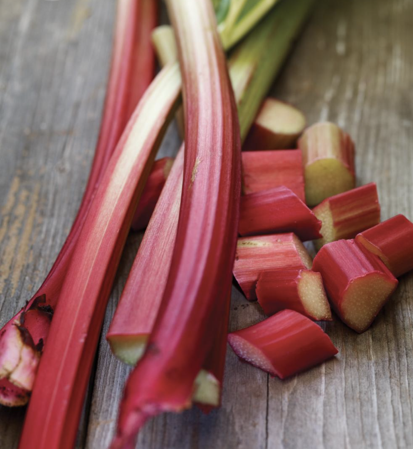

###### *RELATED* : 
---
**Paru dans le Magazine RICARDO Volume 11 Numéro 5** (p. 166)

---
## PREP | COMMENTS

---
# INGREDIENTS

- [ ] 310 ml (1 ¼ tasse) de flocons d’avoine à cuisson rapide
- [ ] 180 ml (¾ tasse) de farine tout usage non blanchie
- [ ] 125 ml (½ tasse) de beurre non salé, ramolli
- [ ] 125 ml (½ tasse) de cassonade
- [ ] 375 ml (1 ½ tasse) de [[Compote De Rhubarbe]]

---
# INSTRUCTIONS

1. Placer la grille au centre du four. Préchauffer le four à 180 °C (350 °F). Beurrer et tapisser un moule carré de 20 cm (8 po) de deux bandes de papier parchemin en les laissant dépasser de chaque côté.
2. Dans un bol, mélanger l’avoine, la farine, le beurre et la cassonade avec les doigts jusqu’à ce que la préparation soit tout juste humectée. Presser la moitié du croustillant dans le moule. Étaler la compote. Couvrir avec le croustillant restant
3. Cuire environ 45 minutes ou jusqu’à ce que le croustillant soit doré. Laisser refroidir complètement. Démouler et couper en carrés.

---
## NOTES

---
## TIPS

---
## NUTRITIONS

---
### *EXTRA* :

