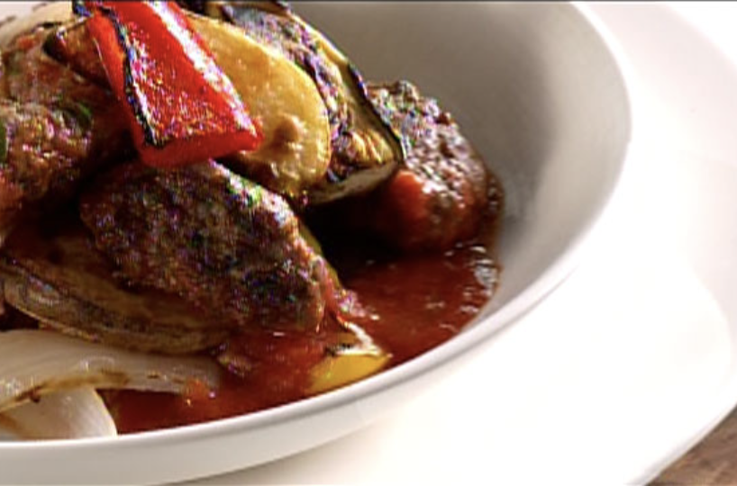

## NOTES

_Vous pouvez préparer ce plat la veille, cependant le sortir du réfrigérateur 30 minutes avant de le cuire au four et compter de 30 à 35 minutes de cuisson._

**_Variante_** 

_Ce plat sera excellent servi avec des pâtes courtes. Cependant, prenez soin de retirer les pommes de terre de la liste d’ingrédients._

## PREP

# INGREDIENTS

#### _PETITES SAUCISSES À L’AGNEAU :_

_1 lb ( 500 g ) d’agneau, boeuf ou porc haché_
_1 bonne poignée de persil italien haché finement_
_1 petit oignon jaune haché finement_
_3/4 c. à thé ( 35 ml ) de piment de Jamaïque moulu ou mélange sept-épices, au goût_
_Sel et poivre du moulin_

#### _LÉGUMES RÔTIS :_

_2 pommes de terre Yukon Gold moyennes_
_2 ( 2 ) aubergines italiennes coupées en 8 quartiers_
_2 poivrons rouges et/ou jaunes coupés en lamelles_
_3 oignons coupés en six quartiers_
_10 à 12 tomates cerises coupées en deux (facultatif)_
_Huile d’olive_
_1 tasse ( 250 ml ) de sauce tomate maison ou du commerce (passata)_
_1 c. à soupe ( 15 ml ) de persil italien ou thym frais haché_
_Piments broyés (facultatif)_
_Sel et poivre du moulin_

# INSTRUCTIONS

#### **_Saucisses à l’agneau_**

_Dans un bol, mélanger tous les ingrédients et bien assaisonner. Façonner la viande en forme de petites saucisses. Pour tester l’assaisonnement, faire cuire une petite quantité (environ 15 ml / 1c. à soupe) dans la poêle ou au four à micro-ondes, goûter et rectifier l’assaisonnement au besoin._

  

_Dans une poêle, chauffer un filet d’huile à feu moyen-élevé et saisir de tous les côtés. Baisser à feu moyen-doux et poursuivre la cuisson environ 5 minutes, en prenant soin de retourner les saucisses à une ou deux reprises. Réserver._

### **_Légumes rôtis_**

_Blanchir les pommes de terre 7 à 8 minutes dans de l’eau salée. Les couper en quartiers._ 

  

_Dans un bol, mélanger chaque légume avec un filet d’huile d’olive et assaisonner. Déposer chacun des légumes sur une plaque de cuisson en prenant soin de les déposer sur le côté de la peau. Rôtir sous le grill au four en vérifiant régulièrement, jusqu’à l’obtention d’une belle coloration._

  

_Préchauffer le four à 190 ºC (375 ºF)._

_Assaisonner la sauce tomate, ajouter le persil et les piments si utilisés. Verser la sauce dans un plat allant au four, y déposer les petites saucisses d’agneau puis couvrir ensuite avec les légumes. Cuire au four de 20 à 25 minutes._

## TIPS

