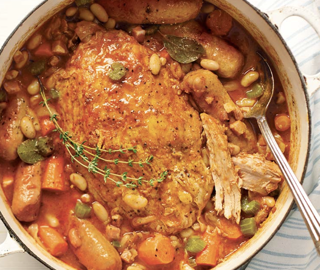

###### *RELATED* : 
---

---
## PREP | COMMENTS

---
# INGREDIENTS

- [ ] 30 ml (2 c. à soupe) d’huile végétale (gras de canard)
- [ ] 1,2 kg (2,5 lb) de fesse de porc avec ou sans os (ou épaule) (en ligne j'ai trouvé qu'une épaule peut être remplacé par une jambe)
- [ ] 2 oignons jaunes, coupés en fins quartiers
- [ ] 3 gousses d’ail, hachées
- [ ] 250 ml (1 tasse) de céleri coupé en morceaux de 1/2 cm (1/4 po)
- [ ] 2 carottes moyennes, coupées en tronçons de 2,5 cm (1 po)
- [ ] Ajouter des panais (=bon)
- [ ] 180 ml (3/4 tasse) de pancetta coupée en dés (lard salé)
- [ ] 45 ml (3 c. à soupe) de pâte de tomate
- [ ] 2 conserves de 540 ml de haricots blancs, égouttés et rincés (1 canne de haricots noirs)
- [ ] 5 ml (1 c. à thé) de moutarde en poudre
- [ ] 3 feuilles de laurier
- [ ] 375 ml (1 1/2 tasse) de bouillon de poulet
- [ ] 2 tiges de thym frais (1 c. thé)
- [ ] 4 saucisses Toulouse entières
- [ ] Au goût, sel et poivre du moulin
- [ ] Mettre des herbes sur le porc

---
# INSTRUCTIONS

1. **Placer** la grille dans le bas du four. **Préchauffer** le four à 150 °C (300 F).
    
2. Dans un grand faitout, à feu vif, faire chauffer l’huile et y faire dorer le porc de chaque côté.
    
3. **Retirer** et **réserver**.
    
4. Dans le même faitout, faire **revenir** les oignons, l’ail, le céleri, les carottes et la pancetta pendant 8 minutes. Y **ajouter** la pâte de tomate et **poursuivre** la cuisson 2 minutes.
    
5. **Ajouter** le reste des ingrédients en terminant par la fesse de porc réservée. **Porter** à ébullition, **couvrir** et **faire cuire au four pendant** 3 heures. [Pourrait être moins) Sur l'épicerie ils disent 300 F 45 minutes pour l'épaule pas d'os, autre source 30 minutes par livre à 375F]
    
6. [Mettre de la sauce sur le porc à la sortie du four]

**For a leg** [found online] : _Simply roast at on high heat for 25 minutes, then lower the heat and continue cooking for about 40-45 minutes, depending on size._ 

_A good rule of thumb is to cook it for 25 minutes per 1 pound of meat._

_[17 avril 2023: 2.558 kg (leg) 375 F, 20  minutes , 325F, 2 heures]_

---
## NOTES

#### [[SECRET DE CHEF]]

Pour savoir si c’est prêt, la viande se détachera facilement à l’aide d’une fourchette.

Bon avec pommes de terre pilées + fèves vertes

---
## TIPS

---
## NUTRITIONS

---
### *EXTRA* :

