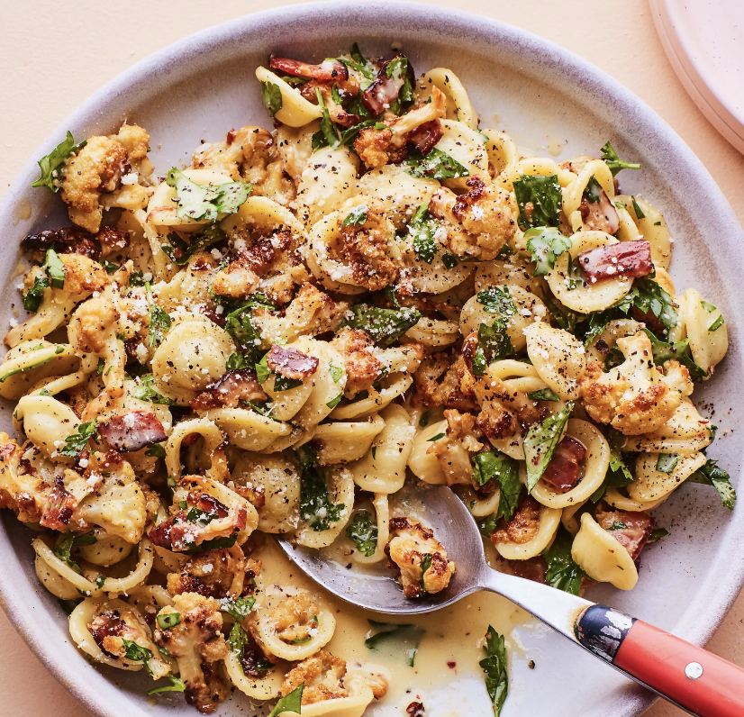

###### *RELATED* : 
---
Cutting the cauliflower florets into small pieces before roasting ensures that they'll be just the right size to get trapped inside the orecchiette, ensuring maximum cauliflower flavor in every single bite.

---
## PREP | COMMENTS

- Active Time : 40 minutes
- Total Time : 45 minutes

---
# INGREDIENTS

- [ ] 1 large head of cauliflower
- [ ] 1/4 cup plus 2 Tbsp. extra-virgin olive oil
- [ ] 1 tsp. kosher salt, plus more
- [ ] 2 1/2 tsp. coarsely ground black pepper, divided, plus more
- [ ] 1 garlic clove
- [ ] 6 oz. bacon, chopped
- [ ] 5 large egg yolks
- [ ] 2 oz. finely grated Parmesan (about 1 cup), plus more for serving
- [ ] 12 oz. orecchiette
- [ ] 1/2 cup chopped parsley (from about 1/2 bunch)

---
# INSTRUCTIONS

1. Preheat oven to 450°F. Remove outer leaves and core of cauliflower. Cut florets into 3/4" pieces. Transfer to a rimmed baking sheet. Add 1/4 cup oil, 1 tsp. salt, and 1/2 tsp. pepper and toss to combine. Roast, tossing once halfway through, until cauliflower is deeply charred in spots, 30–35 minutes. Immediately grate garlic over hot cauliflower and toss to combine (you’re counting on the residual heat to soften the garlic); set aside.
2. Meanwhile, cook bacon in a large skillet over medium-low heat, stirring occasionally, until crisp, 8–10 minutes. Transfer bacon and 1 Tbsp. bacon fat to a large bowl. Add egg yolks, 1 cup Parmesan, 2 tsp. pepper, and remaining 2 Tbsp. oil. Whisk to combine with a fork (it will be very thick, but that’s okay).
3. Add pasta and 1/2 cup cooking liquid to bowl with egg yolk mixture and toss vigorously and continuously with a wooden spoon to create a creamy emulsified sauce that coats pasta, adding more cooking liquid as needed. This may require more tossing than you expect! Keep at it for at least 1 minute. Taste and adjust seasoning, if needed. Add roasted cauliflower and parsley and toss again to coat.
4. Divide pasta among bowls. Top with more Parmesan and a few generous cranks of pepper.

---
## NOTES

---
## TIPS

---
## NUTRITIONS

---
### *EXTRA* :

<iframe src="https://www.epicurious.com/recipes/food/views/cauliflower-carbonara" height="auto" width="100%"/>
