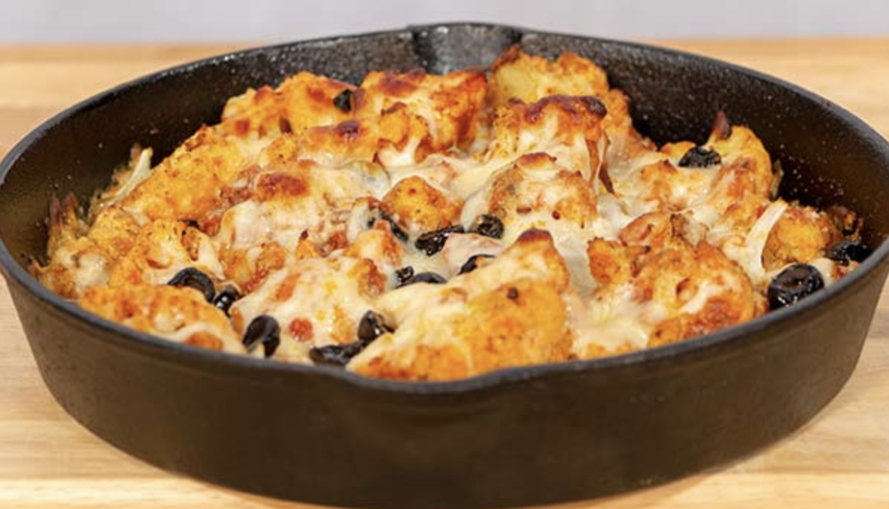

###### *RELATED* : 
---
Prep Time: **20 minutes** Cook Time: **30 to 35 minutes** Total Time: **50 to 55 minutes** Serving Size: **4**

---
## PREP | COMMENTS

---
# INGREDIENTS

- [ ] 2 heads [cauliflower](https://foodfacts.mercola.com/cauliflower.html), cut into florets
- [ ] 2/3 cup organic pizza sauce (en mettre plus)
- [ ] [Himalayan salt](https://foodfacts.mercola.com/himalayan-salt.html), to taste
- [ ] Freshly ground black pepper, to taste
- [ ] 2 cups shredded mozzarella, divided
- [ ] 2/3 cup freshly grated parmesan, divided, plus more for garnish
- [ ] 1/2 cup sliced olives
- [ ] 1/2 cup onions, divided
- [ ] 1 tablespoon [oregano](https://articles.mercola.com/sites/articles/archive/2014/02/01/oregano-health-benefits.aspx), divided
- [ ] 2 teaspoons crushed red pepper flakes, divided
- [ ] Fresh [parsley](https://foodfacts.mercola.com/parsley.html), for garnish
- [ ] Ajout de sausisson Kaiser 150 le 2 oct 2018

---
# INSTRUCTIONS

1. Heat oven to 350 degrees Fahrenheit.
    
2. Blanch the cauliflower for approximately 3 minutes.
    
3. In a large bowl, combine cauliflower with pizza sauce and toss until fully coated. Season with salt and pepper.
    
4. Place half the cauliflower in your baking dish, and top with half of the mozzarella, parmesan, olives and onions. Sprinkle with oregano and pepper flakes.
    
5. Add the rest of your cauliflower to the baking dish and repeat the topping process.
    
6. Bake until cauliflower is tender and cheese is bubbly. This will take approximately 30 minutes.
    
7. Let cool slightly. Garnish with parsley and parmesan. Serve.

---
## NOTES

---
## TIPS

---
## NUTRITIONS

---
### *EXTRA* :

