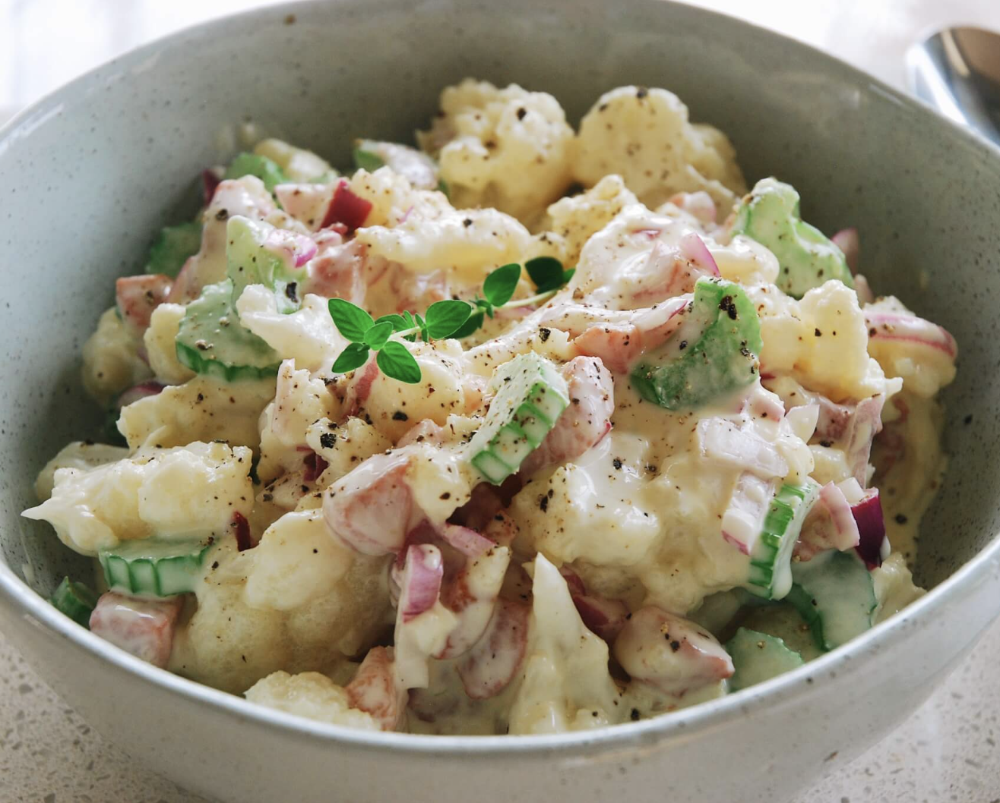

###### *RELATED* : 
---

---
## PREP | COMMENTS

---
# INGREDIENTS

- [ ] 1 head cauliflower, steamed (un assez gros)
- [ ] 5 oz turkey or grass-fed beef bacon, cooked 
- [ ] 3 celery stalks, chopped
- [ ] 1/2 red onion, finely chopped
- [ ] 2 tbs fresh chives
- [ ] Salt and Pepper to taste
- [ ] [J’ai aussi ajouté du persil, j’aurais pu mettre aussi du radis ...]
#### Dressing: [commencer par 1/2 recette et ajuster c’est une recette simple]

- [ ] 1 1/2 cup **[avocado oil mayonnaise](https://amzn.to/2XWL1ZH)** 
- [ ] 3/4 tbsp **[dijon mustard](https://amzn.to/2SmPfII)**
- [ ] 3/4 tbsp **[apple cider vinegar](https://amzn.to/32BceVq)**
- [ ] Salt and pepper to taste

---
# INSTRUCTIONS

1. Gather all the ingredients.
2. Start by making the salad dressing. Mix together the keto mayonnaise, dijon mustard, and apple cider vinegar until well combined. Add in salt and pepper to taste.
3. In a large bowl, add in the steamed cauliflower, chopped celery stalks, cooked bacon, red onion, and fresh chives.
4. Pour salad dressing over salad and mix lightly until combined. Add more salt and pepper to taste.
5. Enjoy!

---
## NOTES

### Special Notes On The Potato Salad:

You want to avoid typical mayo that uses refined vegetable oils such as canola, soy and corn oil.  Best to opt for the avocado oil mayo that you can **[order here](https://amzn.to/2XPSa2L)** or find at your health food store. You can also leave out the bacon if you don’t want that in it.  I don’t advocate eating pig meat as you can **[read about here](https://drjockers.com/dont-eat-pig-meat/)** but you can find a good quality grass-fed beef bacon or turkey bacon.

---
## TIPS

---
## NUTRITIONS

|   |   |   |
|---|---|---|
|Amount Per Serving|   |   |
|**Calories** 126|   |   |
|% Daily Value|   |   |
|**Total Fat** 11 g|   |17%|
|**Total Carbohydrates** 3.5 g|   |1%|
||Dietary Fiber 1.5 g|6%|
||Sugars 1.5 g||
|**Protein** 4 g|   |8%|

---
### *EXTRA* :

