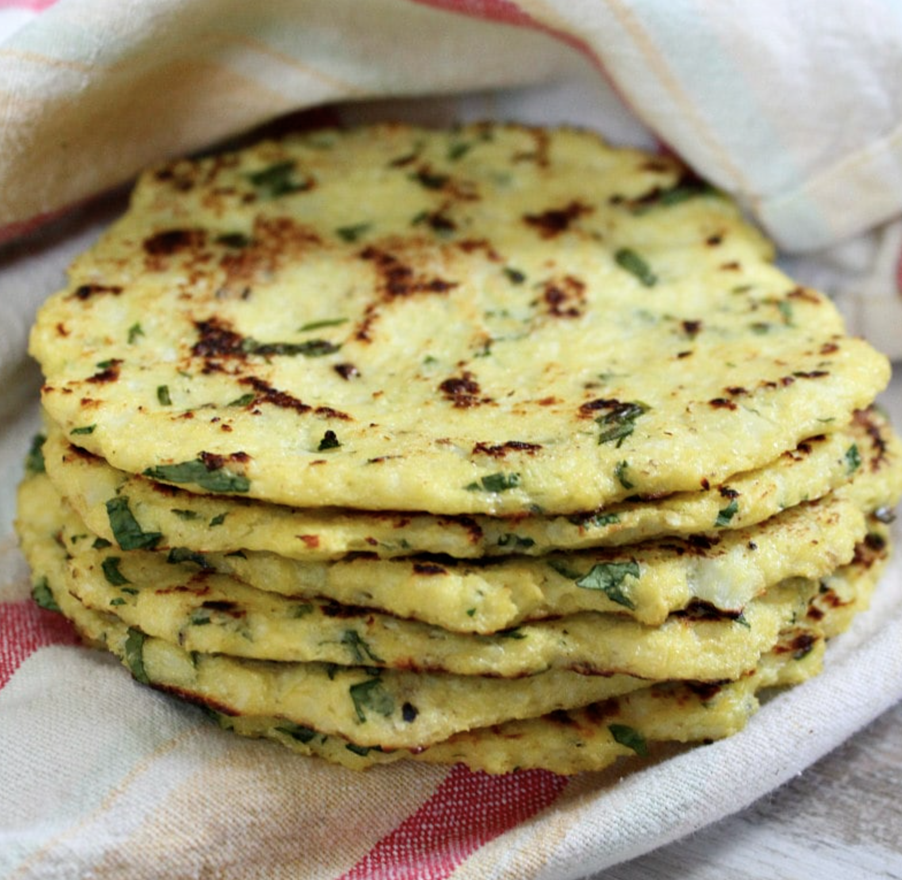

###### *RELATED* : 
---
This recipe may come as a shock to you, but today I’m going to show you how to make tortillas out of cauliflower… yes, these are **Cauliflower Tortillas**!

---
## PREP | COMMENTS

Prep Time: 30 mins Cook Time: 20 mins Total Time: 50 mins

---
# INGREDIENTS

- [ ] 3/4 head cauliflower
- [ ] 2 large eggs
- [ ] 1/4 cup chopped fresh cilantro
- [ ] juice from 1/2 lime (add the zest too if you want more of a lime flavor)
- [ ] salt and pepper, to taste

---
# INSTRUCTIONS

1. Preheat the oven to 375 degrees F. and line a baking sheet with parchment paper.

2. Trim the cauliflower, cut it into small, uniform pieces, and pulse in a food processor in batches until you get a couscous-like consistency. The finely riced cauliflower should make about 2 cups packed.

3. Place the cauliflower in a microwave-safe bowl and microwave for 2 minutes, then stir and microwave again for another 2 minutes. Place the cauliflower in a fine cheesecloth or thin dishtowel and squeeze out as much liquid as possible, being careful not to burn yourself. Dishwashing gloves are suggested as it is very hot.

4. In a medium bowl, whisk the eggs. Add in cauliflower, cilantro, lime, salt and pepper. Mix until well combined. Use your hands to shape 6 small "tortillas" on the parchment paper.

5. Bake for 10 minutes, carefully flip each tortilla, and return to the oven for an additional 5 to 7 minutes, or until completely set. Place tortillas on a wire rack to cool slightly.

6. Heat a medium-sized skillet on medium. Place a baked tortilla in the pan, pressing down slightly, and brown for 1 to 2 minutes on each side. Repeat with remaining tortillas.

---
## NOTES

-  You can munch these by themselves, make quesadillas with them, or add some taco
filling and fold it like a taco.

-  Some people have mentioned in the comments that they've had success using
already riced cauliflower instead of processing a head of cauliflower.

-  Leftover tortillas should freeze well for you.

---
## TIPS

---
## NUTRITIONS

Serving; 1tortilla, Calories: 37kcal, Carbohydrates: 2g, Protein: 3g, Fat: 1g, Cholesterol: 62mg,
Sodium: 39mg, Potassium: 182mg, Fiber: 1g, Sugar: 1g, Vitamin A: 1351U, Vitamin C: 25.9mg,
Calcium: 21mg, Iron: 0.5mg

---
### *EXTRA* :

