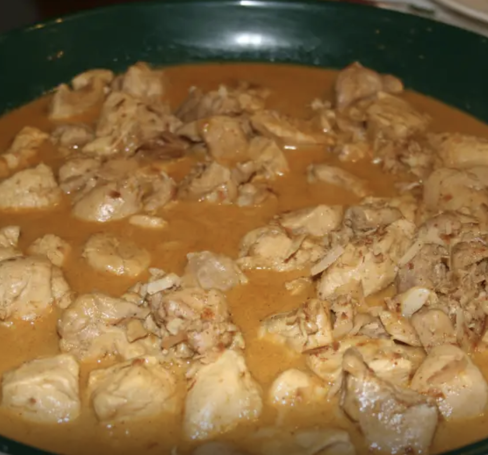

###### *RELATED* : 
---

---
## PREP | COMMENTS

---
# INGREDIENTS

#### **SERVINGS 4 UNITS US** **(pr nous, 2 lbs de poulet pr 5 personnes)**

- [ ] **1 lb chicken breast, cubed**
- [ ] **1 tablespoon ground almonds (remplacé par de la noix de coco le 12 jan et très bon)** 
- [ ] **1 tablespoon desiccated coconut (unsweetened)**
- [ ] **1 cup coconut milk (1L pour compenser pour légumes +++)**
- [ ] **1 teaspoon coriander powder (1 c. Tab)**
- [ ] **1 teaspoon chili powder (1c. Tab)**
- [ ] **2 garlic cloves, crushed** 
- [ ] **1 teaspoon ginger, grated (1 c. Tab) ou 1 c. thé moulu**
- [ ] **1 tsp turmeric   (facultatif)** 
- [ ] **2 teaspoons salt** 
- [ ] **2 tablespoons coconut oil**
- [ ] **2 onions**
- [ ] **Long Green beans** 
- [ ] **Carottes** 
- [ ] **Chou-fleur** 
- [ ] **2 bay leaves (4)**
- [ ] **4 cardamom pods (yes)  (8) On peut aussi utiliser de la cardomome moulue 1 c. thé environ?**
- [ ] **2 dried chilies, crushed (no)  Bon avec un peu de piments en flocons 1/4 tsp**
- [ ] **1 tablespoon cilantro, chopped (optional) or parsley**

---
# INSTRUCTIONS

1. **In a medium pan, dry-roast the almonds and coconut until they are just light brown.**
2. **Remove to a large bowl.**
3. **To the almonds and coconut, add the coconut milk, ground spices, ginger, garlic and salt. (and curcuma)**
4. **Combine well.**
5. **Heat oil in pan.**
6. **Add bay leaves, cardamom pods and chicken cubes.**
7. **Stir-fry this for 2 minutes to seal the chicken.**
8. **Add the vegetables (sauf les fèves que l'on met plus tard dans la cuisson) and cook for a few minutes until the onions start to soften.**
9. **Pour in the coconut milk mixture and stir thoroughly.**
10. **Lower heat, add the dried chillies and cilantro (if using), cover and cook 10-12 minutes, while stirring occasionally.**
11. **Garnish for more cilantro if desired, and serve accompanied with pulao (=pilaf)**

---
## NOTES

---
## TIPS

---
## NUTRITIONS

---
### *EXTRA* :

