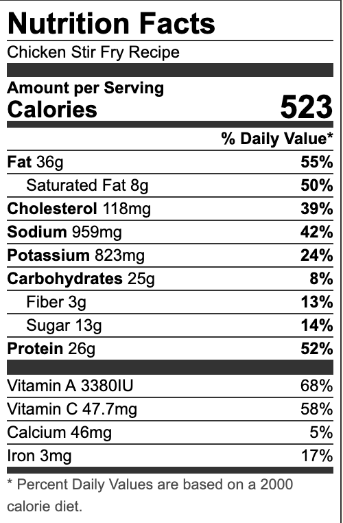

###### *RELATED* : 
---
This **Chicken Stir Fry Recipe** is so much better than takeout! The chicken and vegetables in a garlic ginger soy sauce with honey is the perfect balance of sweet and savory.

---
## PREP | COMMENTS

**Prep Time:** 15 minutes
**Cook Time:** 15 minutes
**Total Time:** 30 minutes
**Servings:** **[4](https://natashaskitchen.com/chicken-stir-fry-recipe/#)**

---
# INGREDIENTS

- [ ] 1 lb chicken thighs cut into bite-sized pieces
- [ ] 1/2 zucchini sliced or cubed
- [ ] 2 Tbsp **[oil](https://amzn.to/2LA1KPF)** divided
- [ ] 1 Tbsp butter
- [ ] 1 cup broccoli cut into florets
- [ ] 1 small carrot julienned or cubed
- [ ] 8 oz mushrooms sliced
- [ ] 1/2 red pepper cubed
- [ ] 4 garlic cloves minced
- [ ] 1 tsp fresh ginger minced
- [ ] 1/2 onion cubed
- [ ] ½ cup cashews

#### **Best Stir Fry Sauce Ingredients:**

- [ ] 1/2 cup **[chicken broth](https://natashaskitchen.com/chicken-stock-chicken-bone-broth/)**
- [ ] 1/4 cup **[water](https://amzn.to/2YgOBPi)**
- [ ] 1/4 cup **[soy sauce](https://amzn.to/2O4ATg1)**
- [ ] 2 Tbsp **[honey](https://amzn.to/2xpje9D)**
- [ ] 1 Tbsp cornstarch

---
# INSTRUCTIONS

1. Trim chicken thighs of excess fat and cut into bite-sized pieces. Cut the vegetables into even-sized pieces (about the same size as the chicken pieces).
    
2. Combine all of the ingredients for the sauce in a bowl.
    
3. In a large pan (or wok), on med/high heat, heat 1 Tbsp oil. Once oil is hot, add chicken in a single layer. Cook chicken until browned, mixing as needed. Once cooked, remove chicken from pan and set aside.
    
4. Add the remaining oil and the butter to skillet with the broccoli, zucchini, mushrooms, red peppers, onion, and carrots. Cook until vegetables are crisp tender, mixing frequently.
    
5. Add chicken back to the pan. Add the garlic and ginger and cook 1 minute, stirring frequently.
    
6. Add the cashews then pour the sauce into the pan and bring to a boil. Turn down heat and let stir fry simmer until the sauce thickens and is well incorporated with the remaining ingredients. Garnish with green onion and sesame seed before serving if desired.

---
## NOTES

---
## TIPS

---
## NUTRITIONS

---
### *EXTRA* :

