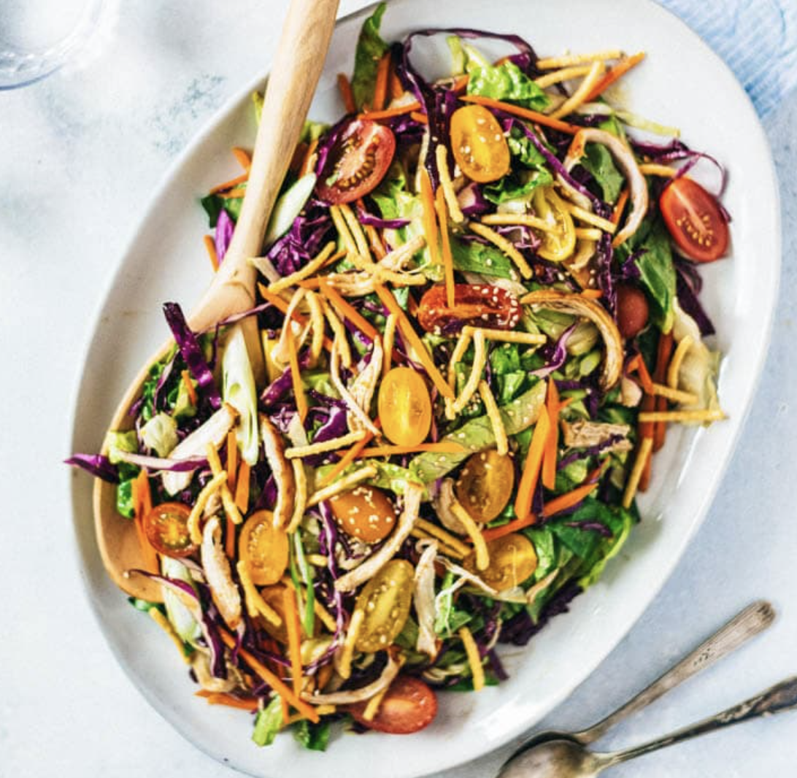

###### *RELATED* : 
---
Introducing one secret ingredient to make your Chinese Chicken Salad dressing creamy, nutty, and extra addictive! The salad is big enough for a light dinner for two, or a side dish for four.

---
## PREP | COMMENTS

---
# INGREDIENTS

#### Dressing

- [ ] 3 tablespoons [Chinkiang vinegar](https://omnivorescookbook.com/pantry/rice-vinegar)  (*Footnote 1)
- [ ] 2 tablespoons [light soy sauce](https://omnivorescookbook.com/pantry/light-soy-sauce)  (*Footnote 2)
- [ ] 2 tablespoon unsalted natural peanut butter
- [ ] 1 tablespoon honey (or agave syrup)
- [ ] 1 tablespoon [sesame oil](https://omnivorescookbook.com/pantry/sesame-oil)
- [ ] 2 teaspoons ginger , minced
- [ ] 2 cloves garlic , minced (yield about 2 teaspoons)
- [ ] 1 tablespoon [homemade chili oil](https://omnivorescookbook.com/how-to-make-chili-oil/) (Optional)

#### Salad

- [ ] 1 small head romaine lettuce , chopped (yield about 4 cups)
- [ ] 1/4 head red cabbage , shredded (yield about 2 cups)
- [ ] 2 big carrots , sliced to thin strips (yield about 2 cups)
- [ ] 2 cups chicken , shredded (rotisserie chicken or leftover chicken)
- [ ] 1 cup cherry tomatoes , halved
- [ ] 3 green onion , sliced
- [ ] 1 cup crunchy chow mein noodles
- [ ] chopped cilantro for garnish (Optional) [Essayer d’ajouter des graines de sésame la prochaine fois]

---
# INSTRUCTIONS

1. Combine all the ingredients for the dressing in a mason jar. Shake until it is well mixed. Let it sit for 10 to 15 minutes while preparing other ingredients. If not serving immediately, store the dressing in the fridge for up to a week.
2. Add romaine lettuce, red cabbage, carrots, chicken, cherry tomatoes, and green onion in a large bowl.
3. Right before serving, pour in the salad dressing and toss to mix well.
4. Garnish with chow mein noodles, if using.
5. Serve immediately as an appetizer or a light main dish.

---
## NOTES

1. Use rice vinegar to replace Chinkiang vinegar if you need a gluten free dish, although the flavor of the dressing will change.
2. You can also use regular soy sauce. Use tamari for gluten free option.

---
## TIPS

---
## NUTRITIONS

Serving: 1of 4 servings, Calories: 376kcal, Carbohydrates: 27.7g, Protein: 27.7g, Fat: 17.3g, Cholesterol: 54mg, Sodium: 596mg, Fiber: 5.1g, Sugar: 11.3g

---
### *EXTRA* :

