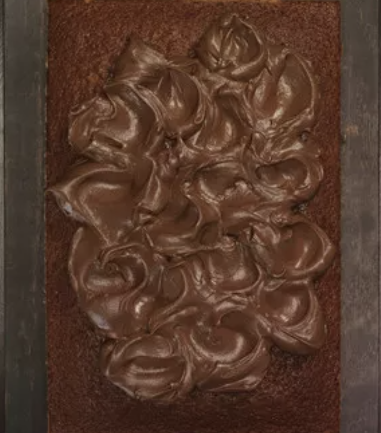

###### *RELATED* : 
---
Decadent indeed, this frosting is a [chocolate lover's](https://www.marthastewart.com/1102398/comfort-cakes-irresistible-flourless-chocolate-cake) dream come true. [Creme fraiche](https://www.marthastewart.com/1540602/creme-fraiche-sour-cream-mascarpone-yogurt-differences-explained) offsets some of the richness. Use it to frost vanilla cake (or chocolate if you're a [chocoholic](https://www.marthastewart.com/1502289/chocolate-dessert-recipes)).

---
## PREP | COMMENTS

---
# INGREDIENTS

- [ ] 12 ounces cream cheese, softened
- [ ] 1 ½ sticks unsalted butter, softened
- [ ] 4 ½ cups confectioners' sugar
- [ ] ½ cup unsweetened cocoa powder
- [ ] Salt
- [ ] 1 pound 2 ounces bittersweet chocolate, melted and slightly cooled
- [ ] 1 ½ cups creme fraiche or sour cream

---
# INSTRUCTIONS

1. Melt chocolate in a bowl set over a saucepan of simmering water. Let cool slightly. Beat together butter, sugar, and salt with a mixer until pale and fluffy, about 5 minutes. Gradually beat in chocolate, then sour cream, and beat until thoroughly incorporated. Frosting should be spreadable. If too loose, refrigerate, stirring occasionally, until thickened. Use immediately, or transfer to an airtight container and refrigerate up to 3 days. Before using, bring to room temperature, and beat until smooth.

---
## NOTES

---
## TIPS

---
## NUTRITIONS

---
### *EXTRA* :

