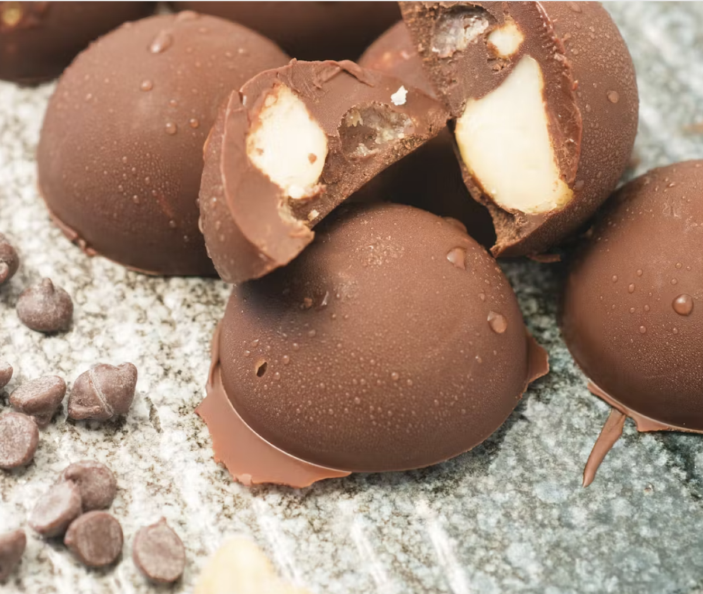

###### *RELATED* : 
---
Macadamia nuts are arguably one of the most [ketogenic](https://www.dietdoctor.com/low-carb/keto) nuts. The only thing that could possibly make them better is — you guessed it — dark chocolate! These fat bombs are salty, sweet, and absolutely delicious.

---
## PREP | COMMENTS

---
# INGREDIENTS

- [ ] 1 1⁄3 oz. (4 2⁄3 tbsp) sugar-free dark chocolate, stevia-sweetened chocolate chips
- [ ] 1 tbsp MCT oil or coconut oil
- [ ] coarse salt or sea salt
- [ ] 1 ½ oz. raw macadamia nuts halves

---
# INSTRUCTIONS

1. 

---
## NOTES

---
## TIPS

---
## NUTRITIONS

---
### *EXTRA* :

