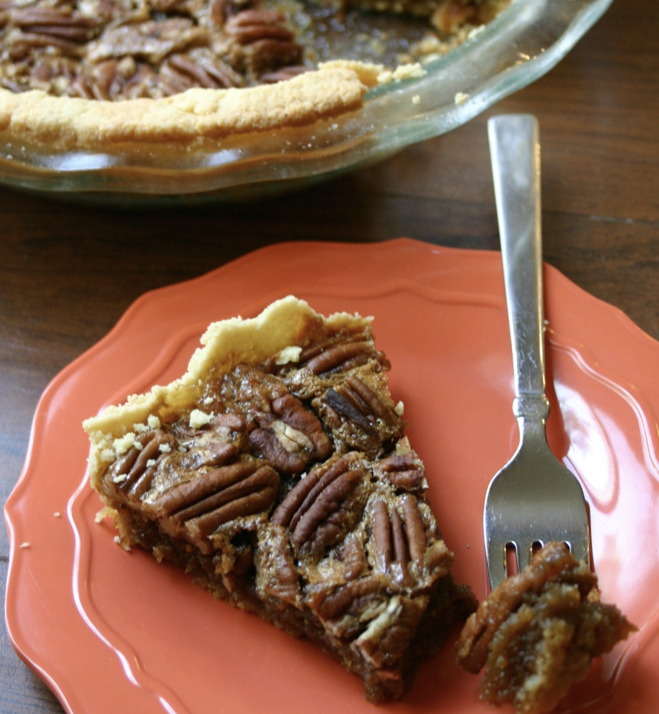

###### *RELATED* : 
---
No one will ever guess that this delicious Pecan Pie is clean eating, paleo friendly, gluten free and refined sugar free! Made with an almond flour crust, heart healthy coconut oil, and sweetened with pure maple syrup, this healthier dessert looks and tastes just as good as the original!

---
### REVIEW

Le dessus est très bon mais je changerais la croûte pour utiliser : [[Gluten-Free Pie Crust]]

---
## PREP

---
# INGREDIENTS
 **(pour la garniture) (essai 2 1/2 recettes pour 2 tartes dans les pyrex bleus)**

- [ ] 2 cups almond flour
- [ ] ¼ teaspoon sea salt
- [ ] 2 tablespoons unrefined coconut oil {I use [Nutiva](http://www.amazon.com/s/?_encoding=UTF8&camp=1789&creative=390957&field-keywords=nutiva%20coconut%20oil&linkCode=ur2&rh=n%3A2619525011%2Ck%3Anutiva%20coconut%20oil&tag=feegrein8cha-20&url=search-alias%3Dappliances&linkId=RF6JMDDMDNYUIV4L)}
- [ ] 1 egg
- [ ] 1 cup + 1 tablespoon [pure maple syrup](http://www.amazon.com/s/?_encoding=UTF8&camp=1789&creative=390957&field-keywords=pure%20maple%20syrup&linkCode=ur2&rh=n%3A16310101%2Ck%3Apure%20maple%20syrup&tag=feegrein8cha-20&url=search-alias%3Dgrocery&linkId=X5ANB5DZES2TJUER)
- [ ] ½ cup [unrefined coconut sugar](http://www.amazon.com/s/?_encoding=UTF8&camp=1789&creative=390957&field-keywords=unrefined%20coconut%20sugar&linkCode=ur2&rh=n%3A16310101%2Ck%3Aunrefined%20coconut%20sugar&sprefix=unrefined%20coco%2Ctoys-and-games%2C278&tag=feegrein8cha-20&url=search-alias%3Dgrocery&linkId=KZARHLOEK65USKH2)
- [ ] 2 tablespoons butter or [ghee](http://www.amazon.com/s/?_encoding=UTF8&camp=1789&creative=390957&fst=as%3Aoff&keywords=ghee&linkCode=ur2&qid=1418662876&rh=n%3A16310101%2Ck%3Aghee&rnid=2941120011&tag=feegrein8cha-20&linkId=4NW4ZLONSJSDP7FU)
- [ ] 3 eggs, lightly beaten
- [ ] 1 teaspoon vanilla extract
- [ ] ¼ teaspoon sea salt
- [ ] 1 ¼ cup pecan halves

#### **Pour la garniture 

- [ ] 1 cup + 1 tablespoon pure maple syrup     
- [ ] ½ cup unrefined coconut sugar    
- [ ] 2 tablespoons butter or ghee    
- [ ] 3 eggs, lightly beaten    
- [ ] 1 teaspoon vanilla extract    
- [ ] ¼ teaspoon sea salt    
- [ ] 1 ¼ cup pecan halves

---
# INSTRUCTIONS

1. Preheat the oven to 400 degrees and adjust rack to lower-middle position.
2. Put flour and salt in a food processor or [Blendtec](http://www.amazon.com/s/?_encoding=UTF8&camp=1789&creative=390957&field-keywords=Blendtec&linkCode=ur2&rh=n%3A2619525011%2Ck%3ABlendtec&tag=feegrein8cha-20&url=search-alias%3Dappliances&linkId=WEY3ZDUC5WIOY7FI) blender. Add coconut oil and egg and pulse until mixture forms a ball. Press dough into 9-inch pie dish. Chill in refrigerator while making the filling.
3. Heat maple syrup in a medium saucepan over medium heat. Simmer until syrup reaches 225 degrees, mine took almost exactly 10 minutes. While syrup is simmering, place coconut sugar and butter or [ghee](http://www.amazon.com/s/?_encoding=UTF8&camp=1789&creative=390957&fst=as%3Aoff&keywords=ghee&linkCode=ur2&qid=1418662876&rh=n%3A16310101%2Ck%3Aghee&rnid=2941120011&tag=feegrein8cha-20&linkId=4NW4ZLONSJSDP7FU) in a medium mixing bowl. As soon as the syrup reaches 225 degrees, immediately pour it over the sugar and butter. Let mix sit for 1 minute and then whisk together. Add eggs, vanilla, and sea salt and whisk (the mixture might look a little grainy).
4. Pour filling mixture into the prepared pie crust and top with pecans. Cover crust with a pie shield or foil. Bake for 15 minutes. Reduce heat to 350 degrees and bake for an additional 15 minutes. The filling will be slightly less set in the center than the edges and it might puff up in the middle a little, but will set as it cools.
5. Serve slightly warm or at room temperature. Enjoy!

---
## NOTES

{serving size = 1/16th of pie – recipe makes 16 servings}  
  
266 calories, 17g fat, 2.1g fiber, 5.5g protein  
  
*Actual nutrition info may vary based on exact ingredients used. Recipe listed on MyFitnessPal as FG8 Clean Eating Pecan Pie.

---
## TIPS

---
## NUTRITIONS

---
### *EXTRA* :

**[essai 2 1/2 recettes pour 2 tartes dans les pyrex bleus]**

