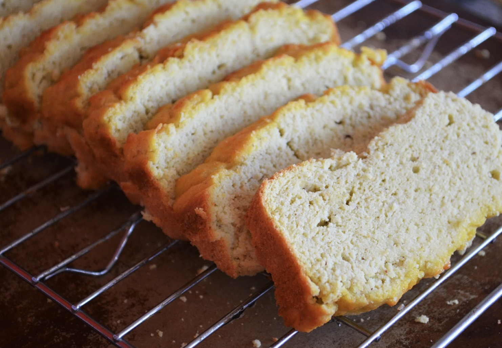

###### *RELATED* : 
---

---
## PREP | COMMENTS

yield 8-12 slices

---
# INGREDIENTS

- [ ] 1 cup of [cashew](http://amzn.to/28JN7oQ) or [almond butter](http://amzn.to/28IXmMq)
- [ ] ¼ cup of [coconut](http://drjockers.com/2013/09/coconut-blueberry-muffins/) [flour](http://amzn.to/28IXyew)
- [ ] 5 pasture-raised eggs
- [ ] ½ tsp of [aluminum-free baking powder](http://amzn.to/28JkSXW)
- [ ] ½ tsp of [baking soda](http://amzn.to/28IXGdO)
- [ ] 2 tsp [apple cider vinegar](http://amzn.to/28JOow8)
- [ ] Optional:  1 tbsp of [keto maple syrup](http://amzn.to/2kslZDC) (remplacé par 10 gouttes de Stevia)

---
# INSTRUCTIONS

1. Pre-heat over to 350 degrees.
2. Gather all ingredients and let sit out at room temperature.
3. Place ingredients into [vitamix](http://drjockers.com/what-is-the-best-vegetable-juicer/) or blend tech blender. Can also use hand blender or food processor
4. Blend until well combined and smooth.
5. Pour batter into well greased 8.5 x 4 loaf pan.
6. Bake 25-30 minutes.

---
## NOTES

---
## TIPS

---
## NUTRITIONS

Serving Size 1 slice

Amount Per Serving

**Calories** 177  

% Daily Value

**Total Fat** 14 g

22%

**Total Carbohydrates** 8 g

3%

Dietary Fiber 4 g

16%

Sugars 3 g

**Protein** 7 g

14%

---
### *EXTRA* :

