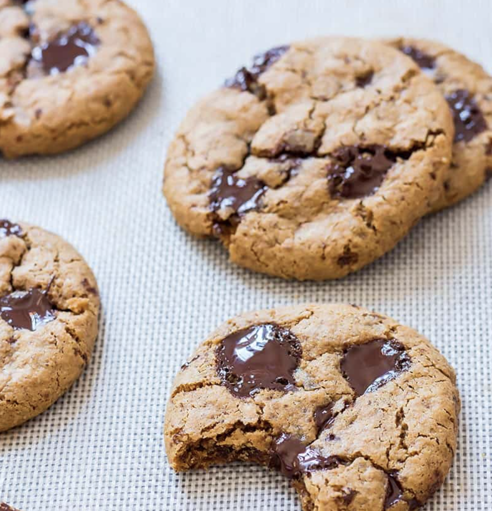
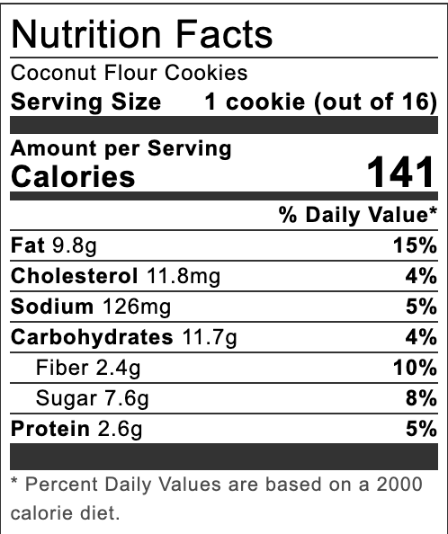

## NOTES

(super bons avec du tahini) 

Environ 25 biscuits pour une recette avec 1 c. Tab de pâte)

* **Sunbutter** may turn the cookies a shade of green (it reacts with the baking soda). They still taste super delicious but the green colour may be disconcerting to some 

**[Flax Egg Recipe](https://leelalicious.com/how-to-make-a-flax-egg-vegan-egg-substitute/)

*** using sugar-free sweetener and chocolate chips changes these nutrition values:carbs: 7  fiber: 3  sugar:1.7

## PREP

# INGREDIENTS

- ¼ cup coconut oil or butter, melted
- ⅓ cup unsalted nut or seed butter peanut, almond, sunflower seed*, or sesame butter (tahini)
- ½ cup coconut sugar or unrefined brown sugar or [monk fruit sugar substitute](https://www.amazon.com/Lakanto-Monkfruit-Sugar-Substitute-Golden/dp/B077SW5YB3?crid=7XCUC4ZFPS90&keywords=lakanto&qid=1674245514&sprefix=lakanto%2Caps%2C133&sr=8-1&th=1&linkCode=ll1&tag=leela17ws-20&linkId=0eceec309f2940796bbe7b88f88e0622&language=en_US&ref_=as_li_ss_tl)***
- 1 egg or flax egg**
- 1 teaspoon vanilla
- ½ cup coconut flour spooned into the measuring cup (don't dip & sweep)
- ½ teaspoon baking soda
- ½ teaspoon sea salt more for sprinkling (optional)
- ½ cup dark chocolate chips or chunks, or [sugar-free chocolate chips](https://www.amazon.com/Chocolate-Sweets-Sweetened-Low-Carb-Gluten-Free/dp/B07HL57HF1?crid=255G2M9H8S1BF&keywords=lakanto+chocolate+chips&qid=1674245629&sprefix=lakanto+cho%2Caps%2C134&sr=8-13&linkCode=ll1&tag=leela17ws-20&linkId=69e36380bf87691b67cb91fdf244de6a&language=en_US&ref_=as_li_ss_tl)

# INSTRUCTIONS

- Preheat your oven to 350° F. Line a baking sheet with parchment paper or a baking mat.
    
- In a large bowl mix melted coconut oil, nut butter, and coconut sugar with an electric mixer until well combined. Add the egg and vanilla and mix again.
    
- Add coconut flour, baking soda, and sea salt. Mix in with a spatula or wooden spoon. Finally stir in the chocolate chips.
    
- Form 16 small cookies (1 tablespoon dough) or 8-10 large cookies (~2 tablespoons dough) with a cookie scoop and place them on the cookie sheet.
    
- Flatten each dough ball and add a couple extra chocolate chips and optionally a touch of coarse sea salt
    
- Bake the cookies until the centers are just set - about 10 minutes for the small size or 12 minutes for the bigger sized cookies.
    
- Let the cookies cool on the cookie sheet for 10 minutes, than move to a wire rack to let them cool completely.
    
- Once fully cooled, store the cookies in an airtight container at room temperature for 3-4 days.

## NUTRITIONS

## TIPS

