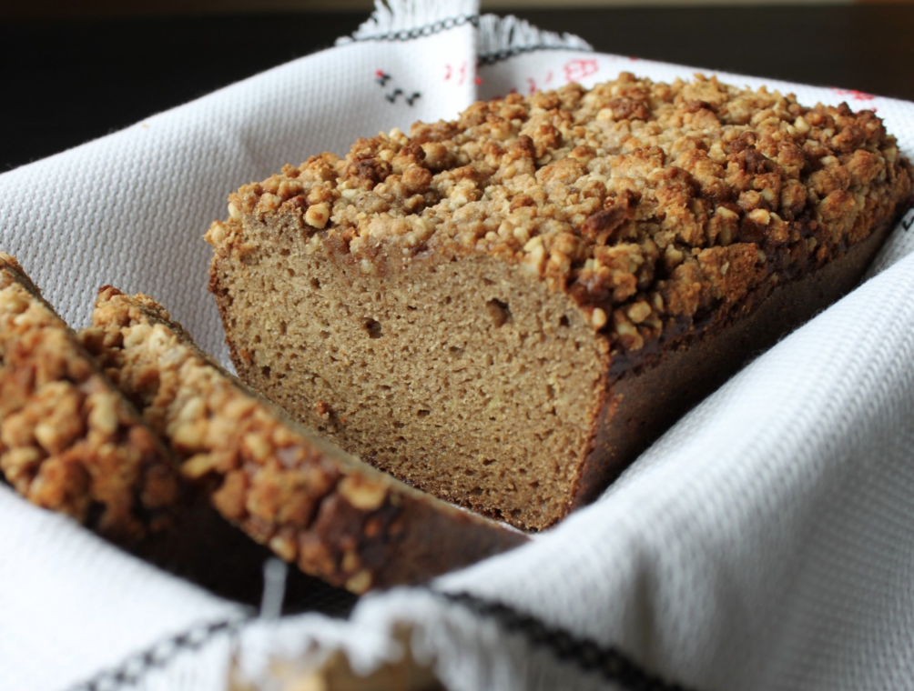

###### *RELATED* : 
---

---
## PREP | COMMENTS

---
# INGREDIENTS

#### **Topping Ingredients:**

- [ ] 1/3 cup walnuts, chopped
- [ ] 3 Tbsp. sifted [coconut flour](https://www.amazon.com/dp/B003XB3NNE/ref=as_li_tf_til?tag=theunrekitc-20&camp=0&creative=0&linkCode=as1&creativeASIN=B003XB3NNE&adid=02A8M5X4NR0S713NNPDS&)
- [ ] 1 Tbsp. coconut oil
- [ ] 1 Tbsp. honey
- [ ] 1/2 tsp. cinnamon
- [ ] 1/8 tsp. salt

#### **Bread Ingredients:**

- [ ] 8 eggs
- [ ] 3/4 cup unsweetened applesauce
- [ ] 1/3 cup honey
- [ ] 3/4 cup grated zucchini
- [ ] 1 tsp. vanilla
- [ ] 3/4 cup sifted [coconut flour](https://www.amazon.com/dp/B003XB3NNE/ref=as_li_tf_til?tag=theunrekitc-20&camp=0&creative=0&linkCode=as1&creativeASIN=B003XB3NNE&adid=02A8M5X4NR0S713NNPDS&)
- [ ] 1 tsp. salt
- [ ] 1 tsp. baking soda
- [ ] 1/4 tsp. baking powder
- [ ] 1 1/2 Tbsp. cinnamon

---
# INSTRUCTIONS

1. Preheat oven to 325 degrees.

2. Mix topping ingredients together in a bowl with a fork until crumbly. Set aside.

3. In a large mixing bowl, beat eggs, applesauce and honey with electric mixer (or whisk well).

4. Mix in zucchini and vanilla.

5. In a separate bowl, mix coconut flour, salt, baking powder, baking soda and cinnamon together.

6. Combine dry ingredients with wet ingredients and mix until there are no lumps.

7. Pour into greased loaf pan and sprinkle crumble mixture evenly on top.

8. Bake at 325 for 55-60 minutes or until toothpick inserted comes out clean.

---
## NOTES

*Store in fridge.

*You can make this bread without the topping as well!

---
## TIPS

---
## NUTRITIONS

---
### *EXTRA* :

