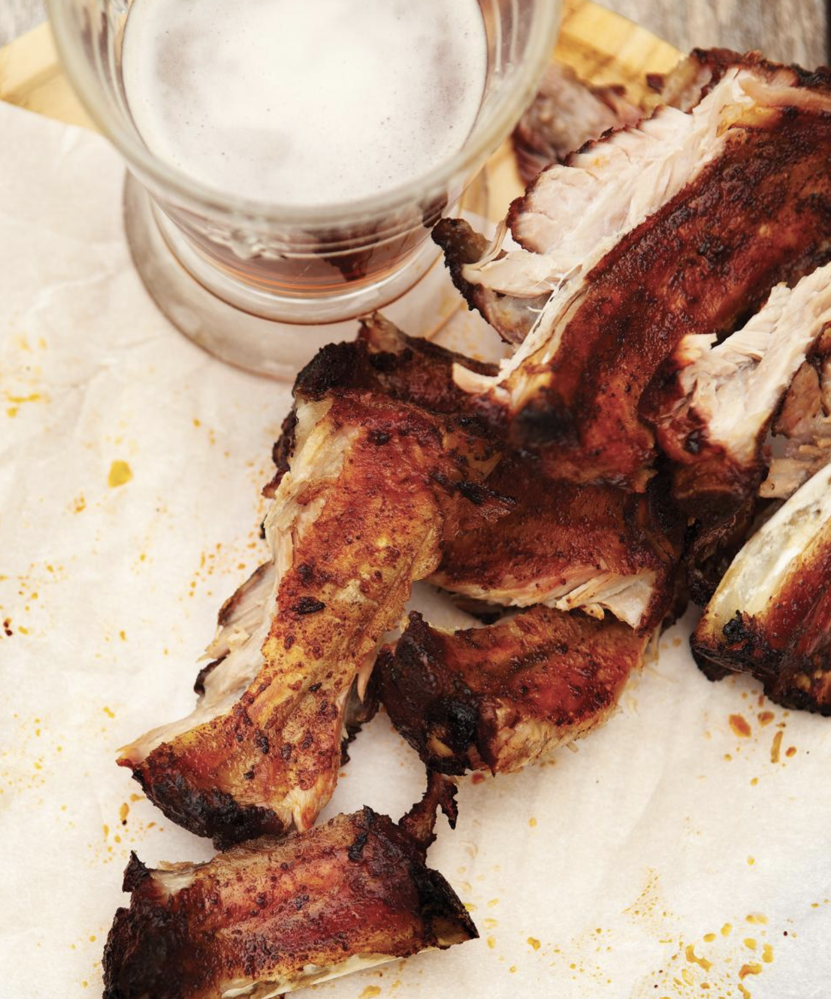

###### *RELATED* : 
---

---
## PREP | COMMENTS

---
# INGREDIENTS

#### **Côtes levées [super bon, genre fait avec cette quantité d'ingrédients avec 2.5 lbs de poitrinwe de porc qui contient des "short ribs"]**

- [ ] 30 ml (2 c. à soupe) de cassonade
- [ ] 15 ml (1 c. à soupe) d’assaisonnement au chili
- [ ] 10 ml (2 c. à thé) de sel
- [ ] 5 ml (1 c. à thé) de poivre noir moulu
- [ ] 2,5 ml (1/2 c. à thé) de poudre d’oignon
- [ ] 2,3 kg (5 lb) de côtes levées de dos de porc

#### **Sauce barbecue [pas essayée]**
    
- [ ] 15 ml (1 c. à soupe) d’assaisonnement au chili
- [ ] 5 ml (1 c. à thé) de poudre d’oignon
- [ ] 2,5 ml (1/2 c. à thé) de poudre d’ail
- [ ] 30 ml (2 c. à soupe) de beurre
- [ ] 125 ml (1/2 tasse) de ketchup
- [ ] 125 ml (1/2 tasse) de vinaigre de cidre
- [ ] 125 ml (1/2 tasse) de gelée de pommes
- [ ] 60 ml (1/4 tasse) de moutarde préparée
- [ ] 15 ml (1 c. à soupe) de sauce Worcestershire

---
# INSTRUCTIONS

#### **Côtes levées

1. Dans un bol, mélanger la cassonade, l’assaisonnement au chili, le sel, le poivre et la poudre d’oignon.
2. Sur un plan de travail, couper les côtes levées en sections de 3 ou 4 os, puis saupoudrer la marinade sèche en frottant bien les épices sur la viande de chaque côté.
3. Verser 250 ml (1 tasse) d’eau dans le récipient de l’autocuiseur. Y placer le plateau à vapeur. Déposer les sections de côtes debout sur le plateau. Couvrir et sélectionner la fonction viande. (Nous avons utilisé le Presto normal et cuit les côtelettes pendant 25 minutes.)
4. Laisser dépressuriser naturellement au moins 15 minutes. Une fois l’appareil dépressurisé, retirer le couvercle. Retirer les côtes levées de l’autocuiseur. Jeter le liquide de cuisson.

#### **Sauce barbecue**
    
- [ ] Entre-temps, dans une petite casserole, faire revenir les épices dans le beurre 1 minute en remuant. Ajouter le reste des ingrédients. Porter à ébullition et laisser mijoter de 10 à 15 minutes ou jusqu’à ce que la sauce soit sirupeuse. Saler et poivrer.
- [ ] Préchauffer le barbecue à puissance moyenne. Huiler la grille.
- [ ] Griller les côtes levées 15 minutes en les retournant fréquemment et en les badigeonnant avec de la sauce. Servir les côtes levées avec le reste de la sauce.

---
## NOTES

---
## TIPS

---
## NUTRITIONS

---
### *EXTRA* :

