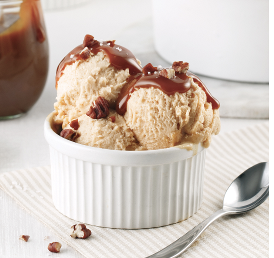

###### *RELATED* : 

On a bien de quoi être fier quand on peut dire à nos [invités](https://www.recettesjecuisine.com/fr/recettes/plats-principaux/porc/one-pot-au-porc-poireaux-et-pommes-caramelises-a-lerable/?gallery=6546) que l’on fait notre propre [crème glacée maison](https://www.pratico-pratiques.com/galeries-thematiques/top-5-de-nos-meilleures-creme-glacees-maison/)! Et avec cette recette de crème glacée vanille et dulce de leche facile à réaliser, on les a dans la poche dès la première cuillerée!

## PREP

# INGREDIENTS

- 1 gousse de vanille (1/2 à 1 c. Thé de vanille pure)
    
- 500 ml (2 tasses) de crème à cuisson 35%
    
- 250 ml (1 tasse) de lait 2%
    
- 5 jaunes d’oeufs 
    
- 125 ml (1/2 tasse) de sucre
    
- 250 ml (1 tasse) de dulce de leche
    
- 80 ml (1/3 de tasse) de pacanes hachées (essai avec des pacanes pralinées : [https://www.joseedistasio.ca/recettes/grignotines/pacanes-caramelisees-a-lerable/](https://www.joseedistasio.ca/recettes/grignotines/pacanes-caramelisees-a-lerable/)
    
- fleur de sel au goût

# INSTRUCTIONS

- Fendre la gousse de vanille en deux sur la longueur. Avec la pointe d’un couteau, gratter les grains et les déposer dans une casserole.
    
- Dans la casserole, ajouter la gousse de vanille, la crème et le lait. Porter à ébullition à feu moyen.
    
- Retirer la gousse de vanille et la rincer à l’eau froide. Conserver au congélateur pour une utilisation ultérieure.
    
- À l’aide du batteur électrique, fouetter les jaunes d’oeufs avec le sucre dans un grand bol, jusqu’à ce que le mélange blanchisse.
    
- Incorporer à la préparation au lait et à la crème. Chauffer en remuant à l’aide d’une cuillère en bois jusqu’à ce que la crème nappe le dos de la cuillère.
    
- Incorporer 160 ml (2/3 de tasse) de dulce de leche. Verser la préparation dans un grand plat et placer au congélateur de 2 à 3 heures, en remuant toutes les 30 minutes.
    
- Déposer la préparation congelée dans le contenant du mélangeur et émulsionner jusqu’à l’obtention d’une texture de crème glacée. Placer aussitôt au congélateur 1 heure.
    
- Au moment de servir, napper chaque portion du reste du dulce de leche. Parsemer de pacanes et de fleur de sel. [[Pacanes Caramelisees A L'Erable]]

## NUTRITIONS

Par portion: calories 582; protéines 8 g; M.G. 37 g; glucides 54 g; fibres 1 g; fer 1 mg; calcium 99 mg; sodium 108 mg

## NOTES

## TIPS

### *EXTRA*

