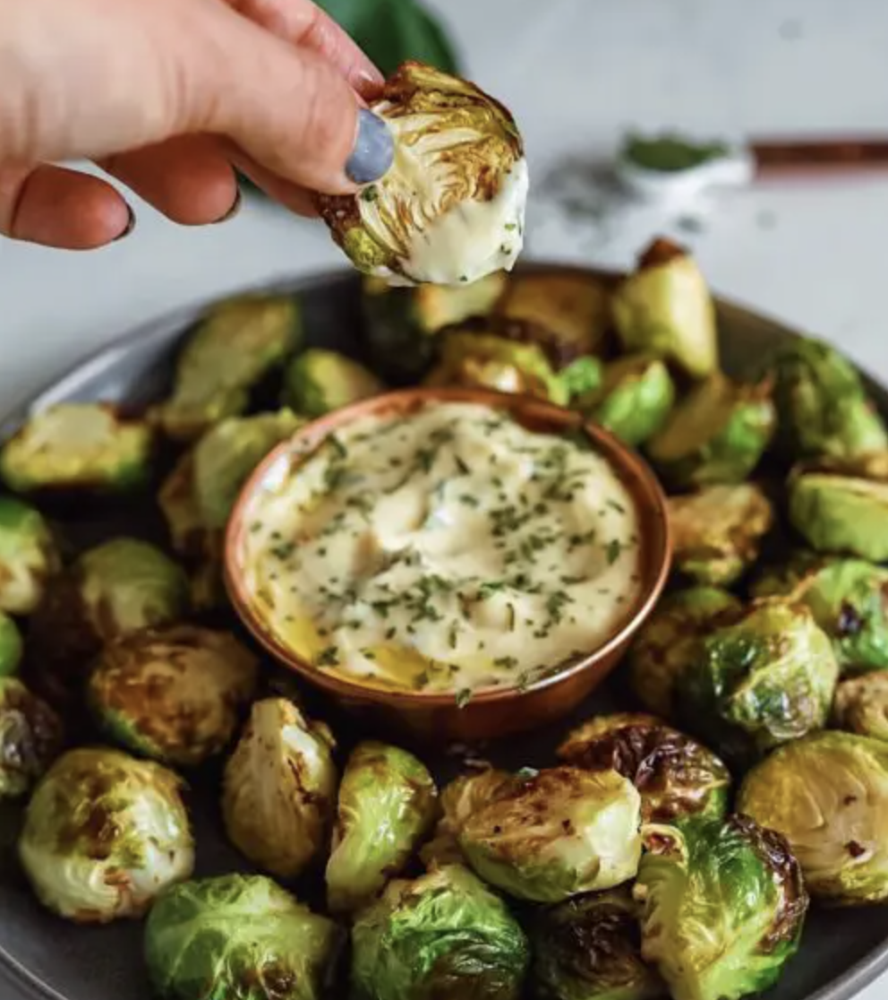

###### *RELATED* : 
---
_The best crispy brussel sprouts with creamy dijon aioli dipping sauce! Oven baked and air fried methods both available in the recipe._

---
## PREP | COMMENTS

---
# INGREDIENTS

#### **Crispy Brussels Sprouts**

- [ ] 1 lb. fresh brussels sprouts, halved. or cut into wedges if they are bigger
- [ ] 1-2 tbsp olive oil
- [ ] 1/4 tsp garlic powder
- [ ] salt and pepper to taste

#### **Dijon Aioli**

- [ ] 1/4 cup mayo
- [ ] 2 tbsp olive oil
- [ ] 1 & 1/2 tbsp dijon
- [ ] 1 tsp minced garlic, garlic powder will also work
- [ ] salt and pepper to taste
- [ ] 1/2 tsp fresh chopped or dried parsley

---
# INSTRUCTIONS

#### Oven Method  
1. **Preheat the oven to 400 degrees F.  
2. Toss your brussels sprouts with olive oil, garlic powder, salt, and pepper. 
3. Arrange them on a baking sheet in a single layer and bake for 18-20 minutes, or until they are crispy and golden enough to your liking! Toss them half way.   
4. Dip the brussels sprouts in the dipping sauce and enjoy!

#### **Air Fryer Method  

- [ ] **Add brussels sprouts (mixed with olive oil, salt, and pepper) in a single layer on the air fryer basket.  
- [ ] Cook at 380 degrees F for about 6 minutes.  
- [ ] Toss them around and cook for another 5-7 minutes or until they’re crispy and golden. Every air fryer is different, I personally like mine super crispy so I keep them in longer! Just keep an eye on them.

- [ ] **Aioli  

- [ ] **Combine all the aioli ingredients besides the parsley. 
- [ ] Mix together and chill until the brussel sprouts are ready.  
- [ ] Serve aioli in a small dipping bowl and top with fresh or dried parsley.

---
## NOTES

---
## TIPS

---
## NUTRITIONS

---
### *EXTRA* :

