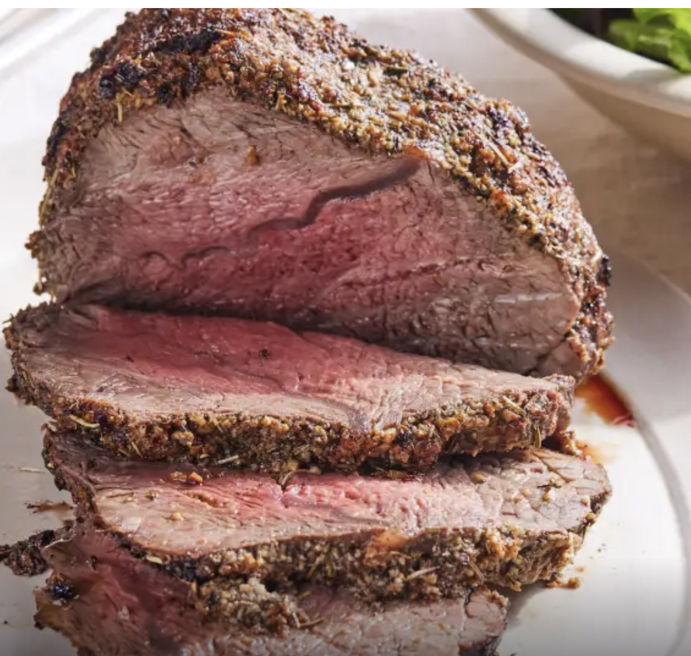
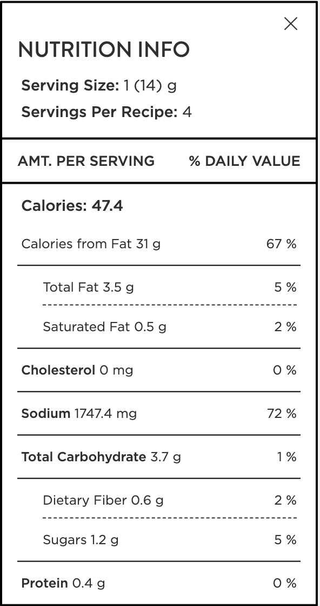

## PREP

# INGREDIENTS

• 2
lbs cross-rib roasts
 (3lbs 7 jan)

- 2
tablespoons balsamic vinegar

- 2
tablespoons minced garlic
- 2
teaspoons dried thyme

- 1
teaspoon dried rosemary

- 1
tablespoon salt

- 1
teaspoon pepper

- 1
tablespoon olive oil

# INSTRUCTIONS

1 Brush roast with balsamic vinegar.

2 Make a paste with remaining ingredients and apply to meat.

3 Roast meat at 450 for 15 minutes Reduce heat to 350 and cook for 40 o 60 minutes (45 min 3 jan), or until internal temperature reaches 125.

4 Remove from oven; cover loosely with foil and let stand 15 to 25 minutes.

## NUTRITIONS

## NOTES

## TIPS

