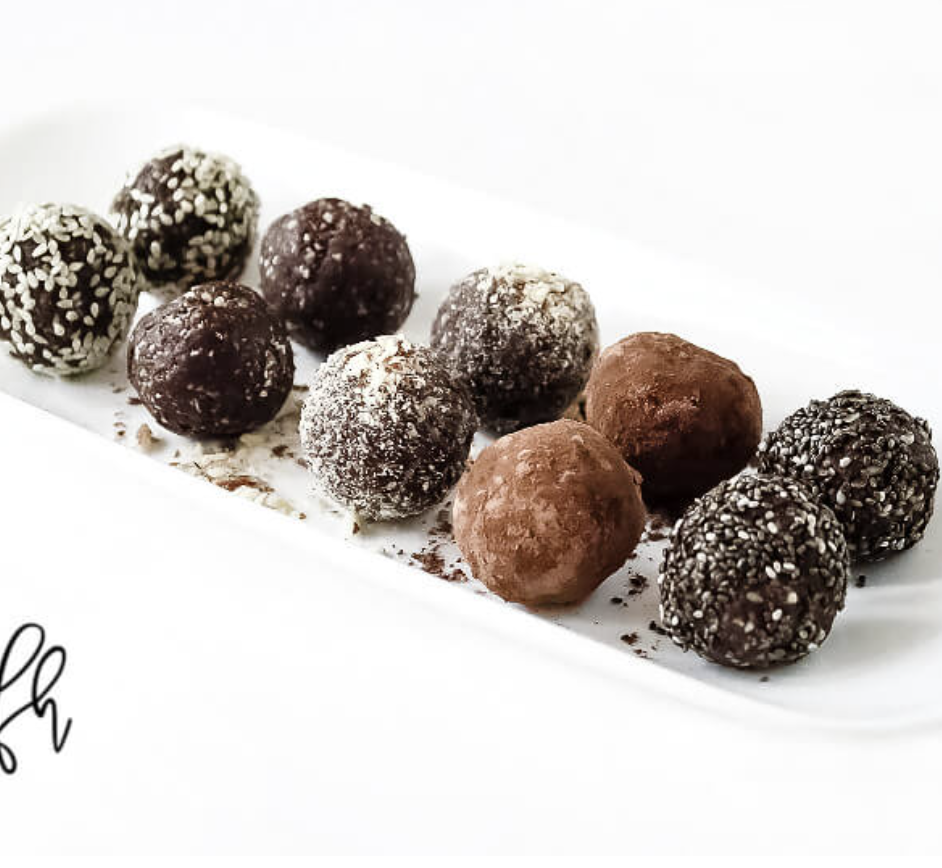

###### *RELATED* : 
---
This healthy, plant-based Crunchy Raw Protein Balls recipe is so easy to make with only 8 clean, real food ingredients. It's a no-bake energy ball with limitless topping options that's vegan and gluten-free and everyone will love!

---
## PREP | COMMENTS

### Equipment

- [Food Processor](https://www.amazon.com/gp/product/B00JXYIODY/ref=as_li_tl?ie=UTF8&tag=thfh-20&camp=1789&creative=9325&linkCode=as2&creativeASIN=B00JXYIODY&linkId=72b5a7e1f84ce7d4087493a13ab4872e)

---
# INGREDIENTS

- [ ] 1 cup almond flour
- [ ] 4 tablespoons organic raw vegan protein powder*
- [ ] 1/2 cup organic nut butter
- [ ] 1/4 cup organic sesame seeds
- [ ] 1/4 cup organic chia seeds
- [ ] 1/4 cup organic raw cacao powder
- [ ] 2 - 3 tablespoons organic maple syrup
- [ ] 1 tablespoon organic coconut oil

---
# INSTRUCTIONS

1. Add all ingredients to a food processor and process until everything is well combined and in a crumbly, paste-type consistency.
2. Scoop out a small spoonful at a time and squeeze tightly in the palm of your hands, then roll them into a small ball shape.
3. Optional: Roll the plain balls in organic sesame seeds, organic cacao nibs, organic shredded coconut flakes, organic raw cacao powder, organic sunflower seeds, organic chia seeds, etc.
4. Store in the refrigerator in an air-tight BPA-free container and they will become firmer.

---
## NOTES

***Vegan Protein Powder:** Because the size of the "scoop" inside the protein powder container varies depending on the brand, you may need to adjust the amount and measure **by the tablespoon** and not by "scoops". For example:

- **Garden of Life Vanilla Raw Organic Meal Replacement** - 1 scoop =  2 tablespoons
- **Sprout Living Epic Plant-Based Protein Vanilla Lucuma** - 1 scoop = 1 tablespoon

**Maple Syrup:** Feel free to substitute with organic date nectar or organic coconut nectar.

**Nut Butter:** You have lots of options here and can use your favorite nut butter like organic peanut butter, organic almond butter, organic cashew butter or even organic sun flower butter.

**Raw Cacao Powder:** Can be substituted with regular cocoa powder, but the recipe will not be 100% raw.

**Coconut Oil:** If you don't like the taste or flavor of coconut oil, you can use organic refined coconut oil which has zero coconut taste or smell.

**Sesame Seeds:** I used organic hulled sesame seeds instead of unhulled sesame seeds.

---
## TIPS

Tip #1:  When using the Garden of Life “Raw Protein”, I’m using the scoop that comes inside the container.  One scoop is considered to be “one serving” and is equal to 4 regular tablespoons. If you use a different brand of protein powder,  just use a “one serving” amount since it may not necessarily be 4 regular tablespoons like the Garden of Life brand.

Tip #2:  You can use your favorite liquid sweetener and make this recipe either 100% raw by using raw organic honey or keep them vegan by using maple syrup, coconut nectar, etc.  This is what ‘holds” everything together. Just start with about 2 tablespoons of sweetener and stir everything together until it gets to a paste-like consistency that will hold a ball shape.  I don’t like too much sweetness in mine so I only use enough to hold them together, not for the “sweetness”.

Tip #3:  You can use the nut butter of your choice in this recipe.  I have used almond butter and even peanut butter and both were good.

Tip #4:   This recipe makes approximately 20 small balls or 10 larger sized balls, depending on how big you make them.

---
## NUTRITIONS

Serving: 1ball | Calories: 120kcal | Carbohydrates: 9g | Protein: 5g | Fat: 9g | Cholesterol: 1mg | Sodium: 40mg | Fiber: 2g | Sugar: 4g | Calcium: 53mg

---
### *EXTRA* :

