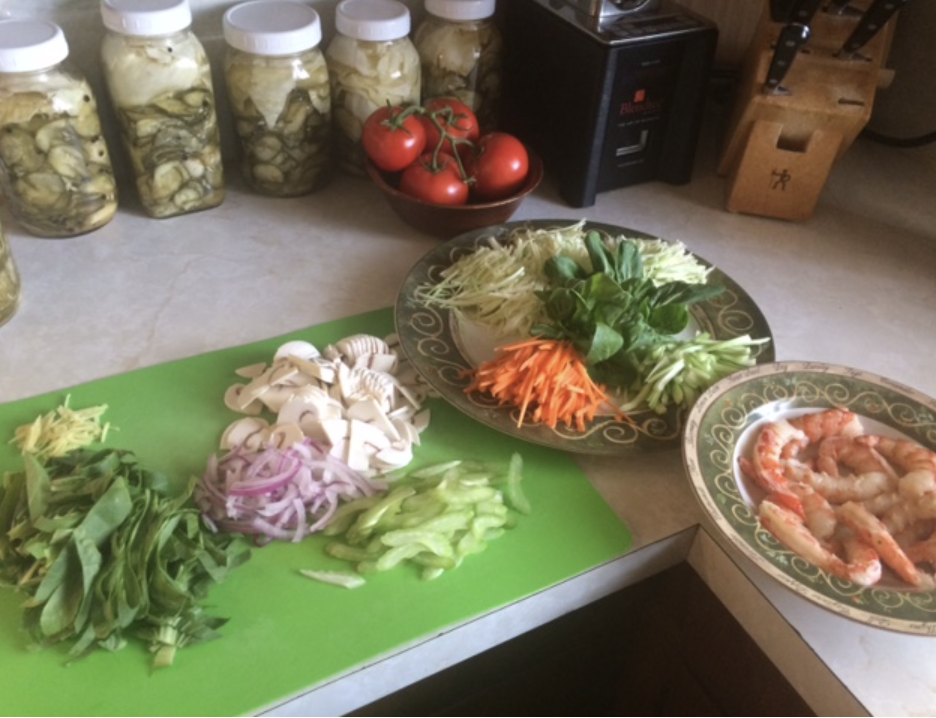

###### *RELATED* : 
---

---
## PREP | COMMENTS

1 portion
Préparation 15 minutes
Cuisson 4 minutes
Prix 3,80 $ par portion

---
# INGREDIENTS

#### Bouillon

- [ ] 7,5 ml (½ c. à soupe) de sauce de poisson
- [ ] 2,5 ml (½ c. à thé) de vinaigre de riz
- [ ] 1 ml (¼ c. à thé) d’huile de sésame grillé
- [ ] 1 ml (¼ c. à thé) de gingembre haché en pot

#### Garnitures

- [ ] 1 nid de nouilles de riz de 50 g (1 ¾ oz)
- [ ] 125 ml (½ tasse) de crevettes nordiques surgelées, non décongelées (ou de poulet cuit effiloché)
- [ ] 250 ml (1 tasse) de légumes coupés finement, au choix (pois mange-tout émincés, champignons enoki, shiitakes tranchés finement ou séchés, carottes râpées, oignons verts hachés, coriandre hachée, fèves germées, bok choy émincé, chou nappa émincé, céleri tranché finement, poivrons en juliennes)

---
# INSTRUCTIONS

1. Dans un pot Mason à large ouverture de 500 ml (2 tasses) ou un contenant hermétique de même capacité, déposer tous les ingrédients du bouillon.
2. Ajouter un nid de nouilles et les crevettes.
3. Couvrir de légumes et refermer. Réfrigérer jusqu’à 3 jours et ne se congèle pas.
4. Au moment de servir, verser 250 ml (1 tasse) d’eau dans le pot.
5. Cuire 4 minutes à découvert au four à micro-ondes. Bien mélanger à la fourchette et déguster.
6. Une fois cuit, se conserve 2 jours au réfrigérateur et ne se congèle pas.

---
## NOTES

Contrairement aux « cup a soup » du commerce, notre version contient suffisamment de protéines pour constituer un repas complet. Aussi, elle renferme en moyenne quatre fois moins de gras

---
## TIPS

#### Astuce

Préparez-en plusieurs à la fois! Répétez les étapes de la recette pour obtenir le nombre de soupes désirées. 

#### Truc anti-gaspillage

N’hésitez pas à varier les légumes selon ce qu’il y a dans votre frigo.

### **Pour un exemple de Marise voir courriel du 25 mars 2017 :**

Lorsqu’elle est venue en sept. 2018 voici ce que nous avons fait:

1 c. Tab huile de coco (faire chauffer)

Mettre carottes et chou (les 2 en petites juliennes) et cuire un peu

Mettre céleri(émincés), oignons(émincés) et gingembre en julienne

Ajouter les bok choy entiers (en avoir des coupés et des non coupés mais seulement mettre les non coupés à cette étape)

Ajouter du bouillon (miso pour 2t et les reste légumes) (8 t. Pour la quantité de légumes et crevettes sur la photo, réduire le feu et ajouter crevettes ou autres protéines, les champignons, et les feuilles de bok choy coupées

Finir avec la sauce soya, le poivre, les échalottes, et un peu d’huile d’olive.

Mon morceau de chou était un peu trop gros, j'en ai laissé un bout.

Il y a au moins 3 tasses au total de : bouillon et eau.

Chauffer le bouillon avec les assaisonnements, quand c'est chaud je met la minuterie à 4min et demi. 

À la première minute, je met tout excepté les nouilles, les champignons, le kale ou épinard et le brocoli.

À la deuxième minute j'ajoute les nouilles.

À la dernière minute et demi je met le kale, les champignons et tout ce qui cuit vite.

C'était très bon et j'ai mangé un œuf cuit dur, mais encore un peu mollet.

IMG_0430.JPG

IMG_0432.JPG

IMG_0435.JPG

---
## NUTRITIONS

---
### *EXTRA* :

