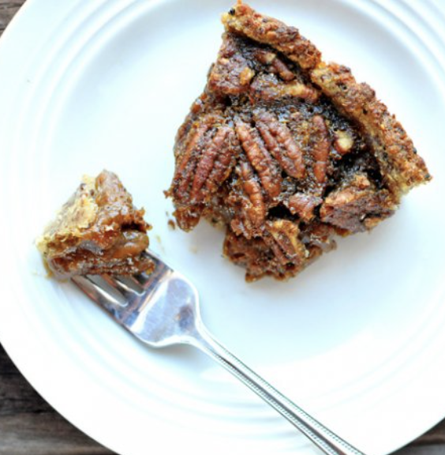

###### *RELATED* : 
---
Decadent Pecan Pie without Corn Syrup, #vegan

---
## PREP | COMMENTS

---
# INGREDIENTS

- [ ] 1 3⁄4 cup Cooked Ancient Harvest Quinoa (for the crust)
- [ ] 1⁄2 cup Brown Rice Flour (for the crust )
- [ ] 2 tablespoons Ground Flax (for the crust)
- [ ] 4 tablespoons Vegan Stick Butter (for the crust, I used Earth Balance)
- [ ] 4 tablespoons Dark Amber Maple Syrup (for the crust)
- [ ] 3 tablespoons Ground Flax
- [ ] 9 tablespoons Warm Water
- [ ] 2 tablespoons Vegan Stick Butter (I used Earth Balance)
- [ ] ⁄4 cup Apple Cider
- [ ] 3⁄4 cups Coconut Sugar
- [ ] 1 teaspoon Pure Vanilla Extract
- [ ] 1 teaspoon Ground Ginger
- [ ] 1 tablespoon Bourbon
- [ ] 1 teaspoon Molasses
- [ ] 1⁄2 cup Dark Amber Maple Syrup
- [ ] 1 teaspoon Salt
- [ ] 4 tablespoons Cornstarch
- [ ] 1 cup Cubed Butternut Squash
- [ ] 1⁄2 cup Vanilla Almond Milk
- [ ] 2 cups Whole Pecans

---
# INSTRUCTIONS

1. Preheat oven to 375 degrees.
2. Prepare your flax eggs -- mix 3 Tbsp flax with 9 Tbsp warm water. Refrigerate for at least 15 minutes. 
3. Combine crust ingredients. Bake for 12 minutes, then take out of oven until pie filling is ready.
4. In a medium saucepan, combine ingredients (butter through cornstarch) over low heat, stirring frequently. It will thicken up over 10 minutes or so while the crust is pre-baking.
5. Cook your butternut squash -- I microwaved mine covered with 1/2 cup of water for 4 minutes on High. Then, drain the water...and add in the almond milk. Use an immersion stick blender to puree. 
6. Add butternut squash/almond milk mixture to the syrup-y mixture on the stovetop as well as the flax eggs made in step 2. Then, stir in pecans.
7. Pour into the partially-baked pie crust, and then bake entire pie for 60 minutes. 
8. Let cool for an hour before slicing.

---
## NOTES

*You can always bake this in a regular pie crust -- and just follow the instructions for the filling for the pecan pie. Up to you!

---
## TIPS

---
## NUTRITIONS

---
### *EXTRA* :

