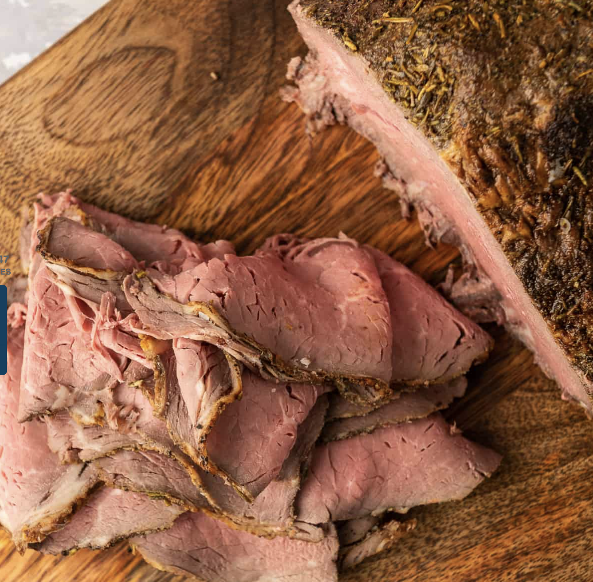

## PREP

##### EQUIPMENT

- [large rimmed baking sheet](https://amzn.to/2HF8Z9x)
    
- [small wire rack](https://amzn.to/3ntRmII)
    
- [instant read meat thermometer](https://amzn.to/3mjnWN9)
    
- [meat slicer](https://amzn.to/39cfzOI)

# INGREDIENTS

• 2 ½ to 3 ½ pound eye of round roast (top or bottom round or top sirloin or sirloin tip also work well) [738g 9 juin]

• 2 tablespoons olive oil or enough to generously coat all sides [bon avec Ghee)Pourrait être un peu moins pour 738 g]

#### Roast Beef Seasoning Mix

• 1 teaspoon kosher salt [Moitié]

• 1 teaspoon dried crushed rosemary [Moitié]

• 1 teaspoon dried thyme [Moitié]

• ¾ teaspoon fresh ground black pepper [Moitié]

• ¾ teaspoon garlic powder [Moitié]

• ¾ teaspoon onion powder [Moitié]

• ½ teaspoon paprika [Moitié]

[Cayenne à essayer (3 pincées le 8 novembre]

# INSTRUCTIONS

-• Remove your roast from the refrigerator and allow it to rest on the counter for 45 minutes to 1 hour to take the chill off.


• Meanwhile, preheat your oven to 500 degrees F.


• Combine all the Roast Beef Seasoning Mix ingredients in a small bowl.


[Mélanger ghee et herbes et étendre sur le rôti.]

• Pat your roast with paper towels to dry the surface and then drizzle with olive oil and use your hands to rub the olive oil, coating all sides of the roast.


• Sprinkle all sides, including the ends, with the seasoning mix. Place your roast on a rack in a roasting pan with the fat cap side facing up.


• Transfer to the preheated oven and roast for 15 minutes until nicely browned. [same 9 juin] Reduce oven temperature to 300 degrees F and continue to roast for another 40 to 50 minutes [20 minutes 9 juin, ok][16 juin 30 minutes avec 1033g semble bien] [essai 25 minutes avec 905 g, pourrait être qq minutes de moins] or until internal temperature reads 130 and no more than 135 degrees F. [medium rare]. Begin checking temperature after 35 minutes by inserting an instant read thermometer through the center of the roast from the side. Watch it closely because the temperature can rise quickly towards the end of the cooking time. I don’t recommend cooking this roast beyond 135 degrees for the most tender, delicious result.


• Remove from the oven and allow it to rest for 20 to 30 minutes before slicing. Alternately, after the resting time, wrap the roast in foil and refrigerate it for several hours or overnight before slicing. It will be easier to slice thinly when chilled.



• Use a meat slicer or a sharp knife to slice the roast against the grain as thinly as possible.

## NUTRITIONS

Serving: 4ounces | Calories: 311kcal | Carbohydrates: 1g | Protein: 43g | Fat: 14g | Saturated Fat: 4g | Cholesterol: 121mg | Sodium: 442mg | Potassium: 663mg | Fiber: 1g | Sugar: 1g | Vitamin A: 70IU | Calcium: 40mg | Iron: 4mg

## NOTES

My favorite cut and the one tested for this recipe is the eye of round roast. It is a lean, flavorful, and relatively inexpensive cut of beef. My local Costco regularly carries a two-pack of prime eye of round roasts at a great price. This cut should be easy to find at most grocery store chains.

Although I haven’t tested it for myself, I believe this recipe would also work well with a top or bottom round roast. One of my recipe testers used a top sirloin roast with a fabulous result leading me to believe that a sirloin tip roast would also be a good choice.

How to Store

Wrap the cooled, sliced roast beef in heavy duty foil and place the foil packet in a plastic storage bag. Label it with the date and refrigerate it immediately. It can also be stored in shallow, airtight deli meat container.

This Deli Style Roast Beef should be refrigerated and used within 3 to 4 days for the best quality and food safety concerns.

For longer storage, I recommend portioning it out and sealing it with a vacuum sealer. Vacuum sealed deli meat stored in the refrigerator will stay fresh for up to 10 days. Pop it in the freezer and store it for up to 2 to 3 months. Safely thaw frozen cooked meat completely in the refrigerator before serving. No vacuum sealer? Wrap the deli meat securely in wax paper and then a layer of heavy duty foil before freezing.

## TIPS

**How to Store**

Wrap the cooled, sliced roast beef in heavy duty foil and place the foil packet in a plastic storage bag. Label it with the date and refrigerate it immediately. It can also be stored in shallow, airtight [deli meat container](https://amzn.to/35pBNM3).

This Deli Style Roast Beef should be refrigerated and used within 3 to 4 days for the best quality and food safety concerns.

For longer storage, I recommend portioning it out and sealing it with a [vacuum sealer](https://amzn.to/3ovbZ8N). Vacuum sealed deli meat stored in the refrigerator will stay fresh for up to 10 days. Pop it in the freezer and store it for up to 2 to 3 months. Safely thaw frozen cooked meat completely in the refrigerator before serving. No vacuum sealer? Wrap the deli meat securely in wax paper and then a layer of heavy duty foil before freezing.

