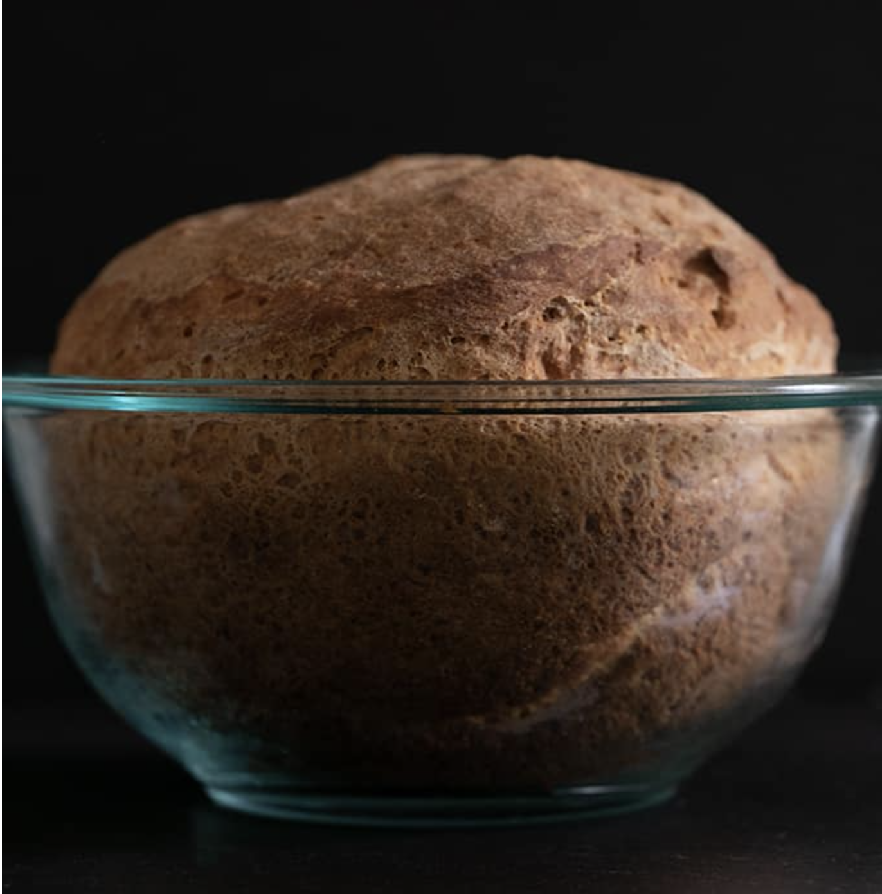

###### *RELATED* : 
---
Bring crusty bread back to the table with this gluten free artisan bread recipe. This gf bread recipe requires no kneading and tastes just like "real" bread.

---
## PREP | COMMENTS

Prep Time:15minutes minutes
Cook Time:45minutes minutes
Rising time:45minutes minutes
Yield:  10 servings

---
# INGREDIENTS

- [ ] - 1 ⅝ cups (227 g) [all purpose gluten free flour blend](https://glutenfreeonashoestring.com/all-purpose-gluten-free-flour-recipes/) (I used & highly recommend Better Batter; please click thru for appropriate blends)
- [ ] 1 ¼ teaspoons xanthan gum omit if your blend already contains it
- [ ] 6 tablespoons (54 g) [tapioca starch/flour](http://www.authenticfoods.com/products/item/33/tapioca-flour)
- [ ] 2 teaspoons (8 g) granulated sugar
- [ ] 2 teaspoons (6 g) [instant yeast](https://glutenfreeonashoestring.com/is-yeast-gluten-free/)
- [ ] ¼ teaspoon baking soda
- [ ] 1 teaspoon (6 g) kosher salt
- [ ] 1 cup (8 fluid ounces) warm milk (about 95°F)
- [ ] 1 (50 g (weighed out of shell)) egg at room temperature, beaten
- [ ] 1 tablespoon (14 g) extra virgin olive oil

---
# INSTRUCTIONS

1. Grease a 1 or 1 1/2 quart glass oven safe bowl and set it aside. If you don’t have a glass bowl, you can use a small round pan or cast iron skillet with high sides. If using an aluminum pan that isn’t dark in color, raise the oven temperature to 400°F.
2. In a large bowl, place the flour, xanthan gum, tapioca starch/flour, sugar, and yeast, and baking soda, and whisk to combine well. Add the salt, and whisk again to combine well.
3. Create a well in the center of the dry ingredients and add the milk, egg, and oil, and mix vigorously. The bread dough/batter should come together and lighten a bit in color as you mix.
4. Transfer the dough/batter to the prepared baking bowl, skillet, or pan, and smooth the top with clean, wet hands or a moistened spatula. Do not compress the dough at all.
5. Cover the dough completely with an oiled piece of plastic wrap. Be careful not to compress the dough, but cover the bowl securely.
6. Place it in a warm, moist place to rise for about 45 minutes, or until the dough has increased to about 150% of its original size. In cool, dry weather, the dough may take longer to rise; in warm, moist weather, it may take less time to rise.
7. When the dough is nearing the end of its rise, preheat your oven to 375°F.
8. After the dough has risen, remove the plastic wrap. Place the bowl in the center of the preheated oven and bake for 30 minutes, or until the bread is lightly golden brown all around.
9. Remove the bread from the oven and rotate the loaf in the bowl, so it’s upside down. Return the bread to the oven and bake until the crust has darkened slightly all around, and the bread sounds hollow when thumped anywhere, on the bottom or top, about another 15 minutes.
10. The internal temperature of the bread should reach about 195°F on an instant-read thermometer.
11. Turn the bread out onto a wire rack to cool completely before slicing and serving.

---
## NOTES

---
## TIPS

---
## NUTRITIONS

---
### *EXTRA* :

