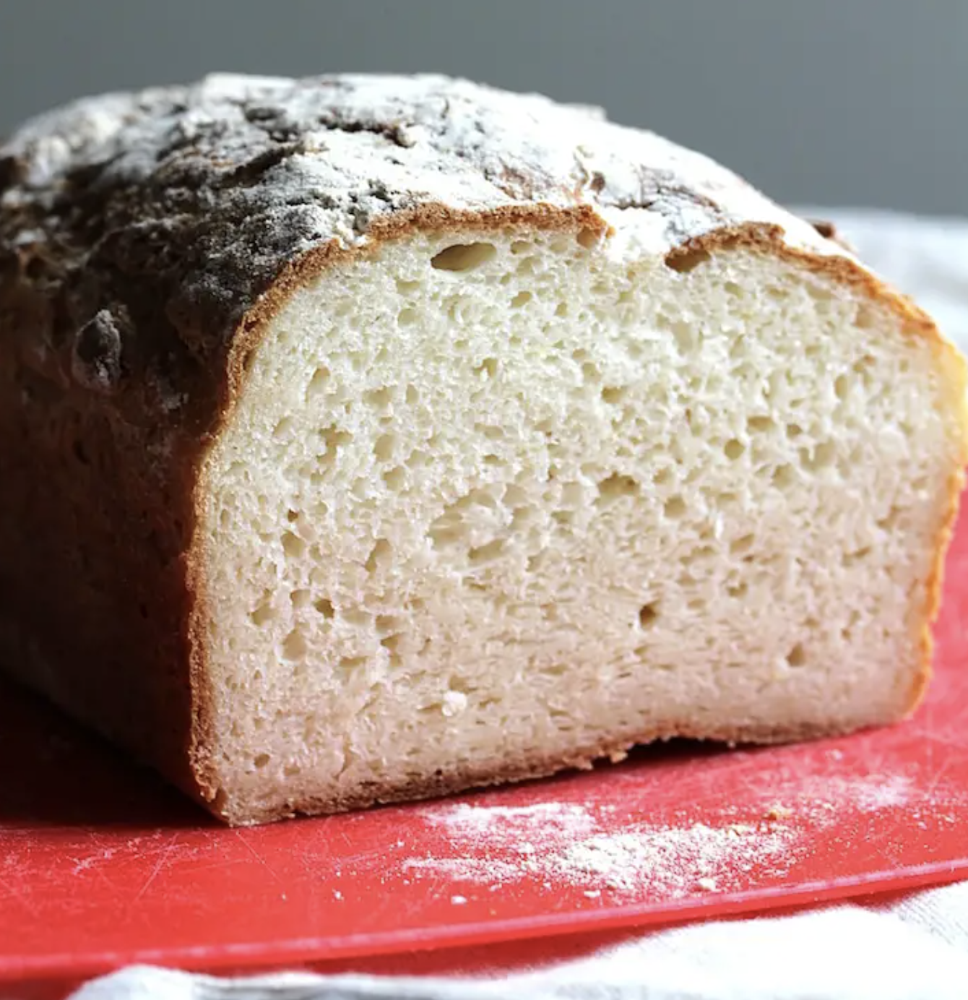

###### *RELATED* : 
---
This easy gluten-free sandiwch bread is soft, fluffy, and holds together perfectly! Perfect for grilled cheese, toast, and even french toast!

---
## PREP | COMMENTS

---
# INGREDIENTS

- [ ] 520 grams [[The Best Gluten-Free Bread Flour Mix]], plus more for dusting - see note for link, no substitutions* 
- [ ] 10 grams instant yeast (appx 2 3/4 tsp)
- [ ] 2 tbsp sugar
- [ ] 2 tsp salt
- [ ] 2 cups water, room temperature
- [ ] 3 tbsp olive oil

---
# INSTRUCTIONS

#### Make the Dough

1. Whisk together the flour, yeast, sugar, and salt in a large mixing bowl.
    
2. Combine the water and oil in a measuring up.
    
3. Using a stand mixer with the dough attachment, or a hand mixer with the dough attachments, slowly incorporate the liquid with the dry ingredients at a slow speed.** After you have added all the liquid, beat the dough for a full 5 minutes. You will notice the texture of the dough change. This step is very important to ensure that the flour hydrates properly.
    
4. Leave the dough in the mixing bowl and cover with plastic wrap. Let the dough rise for 1-2 hours, until double in size. Rising time will depend on the temperature of the room -- if it's cold, it will take longer to rise. If it's warm, the rising time will be shorter. It is important that you do not underproof or overproof the dough.
    

#### Prepare the Loaf

1. Line a loaf pan with parchment paper and sprinkle a little flour evenly on the bottom of the pan.
    
2. Oil a spatula or cover it with cooking spray. Use the spatula to fold the dough (this is the equivalent of kneading it after it's second rise). If the dough begins to stick to the spatula, re-oil it.
    
3. Put your dough into the prepared loaf pan. The dough won't be thin enough to pour, so guide it into the pan with the spatula.
    
4. Oil with the spatula again and use it to smooth the top of the bread. Cover with plastic wrap and let the dough rise for an additional 30-45 minutes.
    
5. Preheat the oven to 450 degreed Farenheit with on rack in the middle and one on the bottom. Place a small roasting pan (or somthing similar) to the bottom rack. When you put the bread in the oven, you'll pour hot water into the pan to create steam. You want the oven to be very hot and at temperature, so I like to have it running a good 30 minutes before I plan to put the bread in the oven.
    

#### Bake the Loaf

1. Remove the plastic wrap and sprinkle the top of the dough with flour (not necessary, but makes it look more artisinal!) Have 1 cup of hot taper water ready to use when you place the dough in the oven.
    
2. Place the dough on the middle rack and quickly pour the hot water into the pan on the bottom rack. Close the oven door quickly. This technique creates steam which helps the bread rise and also get a nice crust.
    
3. Bake the loaf for approximately 40 minutes, it will be a deep dark brown.
    
4. Once the loaf has cooled slightly, remove it from the pan and place on a cooling rack. Let the loaf cool COMPLETELY befor cutting into it. If you cut it too early, the texture will not be as good.
    
#### Store the Loaf

1. After you have cut into the bread, store it in a paper or plastic bag. If using a plastic bag, do not seal it completly. You can also loosely wrap it in plastic wrap. It is best if eaten within 2 days, but I've kept it longer and it holds it's texture pretty well.

---
## NOTES

This dough is wet and sticky. After you’ve beaten it, it will look almost like buttercream frosting. There is no way you could knead this dough without having to add TUNS of extra flour, which would inevitably ruin the bread’s texture.

After the first rise, brush a spatula with oil or coat it with cooking spray. You’ll fold the dough gently using the spatula and pour it into a prepared loaf pan. It won’t pour into the pan like a cake batter, you’ll need to use your oiled spatula to guide it into the pan. Then you can use your spatula to smooth the top. You may need to re-oil your spatula a few times during this process.

Cover the dough and let is go through it’s second rise. When you’re ready to bake it, you can sprinkle on some extra flour to the get the artisan bread look.

---
## TIPS

*I worked a long time to create a **[perfect flour blend](https://theveganharvest.com/2020/05/26/the-best-gluten-free-bread-flour-mix/)** and this recipe was designed specifically to work with this blend. I have not tried this recipe with other blends and cannot guarantee you will achieve the same results. There are sooo many gluten free flour blends out there and they are all so different. I highly recommend using my blend, linked above and in the post. 

**My mom has successfully used a food processor. You could also do this by hand but it will take a while!

---
## NUTRITIONS

---
### *EXTRA* :

