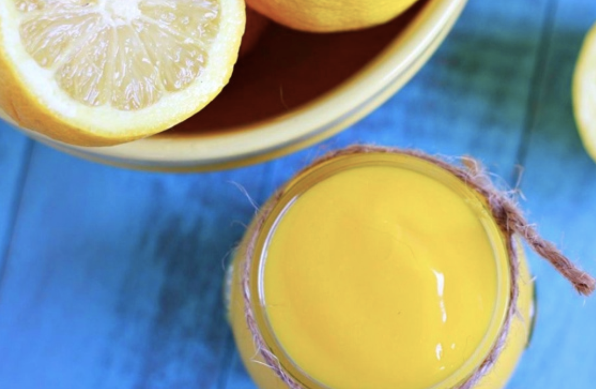

###### *RELATED* : 
---
Every time I think of lemons, my mouth waters.  Tangy and tart.  I love them.  And I especially love them in desserts.  And here’s the easiest lemon desert of them all:  **Lemon Curd.**

---
## PREP | COMMENTS

---
# INGREDIENTS

- [ ] 2 eggs
- [ ] 2 egg yolks
- [ ] 1/3 cup raw honey ([like this](http://www.amazon.com/gp/product/B00014JNI0/ref=as_li_tl?ie=UTF8&camp=1789&creative=390957&creativeASIN=B00014JNI0&linkCode=as2&tag=thesavolotu-20&linkId=6SYEJV5VBP4DFGXB))
- [ ] 1/2 cup fresh lemon juice (Meyer lemons are the BEST)
- [ ] zest from 2 lemons
- [ ] pinch of unrefined sea salt (I use [this one](http://www.amazon.com/gp/product/B000EITYUU/ref=as_li_tl?ie=UTF8&camp=1789&creative=390957&creativeASIN=B000EITYUU&linkCode=as2&tag=thesavolotu-20&linkId=S5ZNLLEGBU6OBWLJ))
- [ ] 6 TBS coconut oil ([like this](http://www.amazon.com/gp/product/B000GAT6NG/ref=as_li_tl?ie=UTF8&camp=1789&creative=390957&creativeASIN=B000GAT6NG&linkCode=as2&tag=thesavolotu-20&linkId=MJXSYYEXDVJCRBAW)) or ghee (I used half and half)

---
# INSTRUCTIONS

1. In a small pan, whisk together eggs, yolks, honey, lemon juice, salt and zest. Add fat of choice and turn heat to low.
2. Cook on low until fat is completely melted, stirring constantly.
3. Turn heat to medium and continue to cook and stir until mixture thickens ~ about another 5-7 minutes. You will know it is done when tiny little bubbles begin to come to the surface.
4. Immediately strain through a sieve and refrigerate. The curd will thicken even more when it sets.

---
## NOTES

---
## TIPS

---
## NUTRITIONS

---
### *EXTRA* :

