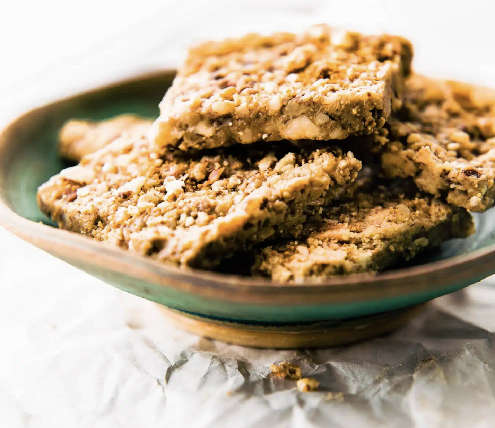

###### *RELATED* : 
---
Healthy, vegan friendly, paleo baklava bars are packed full of sweet nutty flavor and healthy fats. Taste like dessert, but made with REAL FOOD.

---
## PREP

---
# INGREDIENTS

- [ ] ½ cup chopped hazelnuts (see notes for substitutes)
- [ ] ½ heaping cup chopped walnuts or pecans (about ½ c 2 tablespoon total)
- [ ] ½ cup almond meal
- [ ] 1 ½ Tablespoons coconut oil
- [ ] ⅛ teaspoon sea salt or kosher salt
- [ ] ¼ cup honey (maple syrup or brown rice syrup for vegans)
- [ ] ¼ – ⅓ cup creamy tahini or smooth almond butter
- [ ] 2 Tablespoons coconut flour
- [ ] Dash ground cinnamon, optional
- [ ] 1 teaspoon pure vanilla extract

---
# INSTRUCTIONS

1. First, make sure your nuts are chopped. It’s easier just to buy pre-chopped, but both work.
2. In a skillet or pan, toast chopped nuts, almond meal, coconut oil , and salt until lightly coated toasted, about 2 minutes to 3 minutes max.
3. Mix in honey until it bubbles, then remove from heat and let cool for 5 minutes.
4. Next place your nuts in a bowl and mix in almond butter or tahini , extract, and coconut flour.
5. Spread and flatten into 8×8 dish to cool.
6. Refrigerate or freeze for 30 minutes.
7. Slice into into squares and wrap each square in plastic wrap or foil to hold the texture.
8. Keep in fridge due to coconut oil

---
## NOTES

- Feel free to add in coconut or any other dried fruit to the mix when toasting nuts!
- If you prefer, you can use pistachios versus hazelnuts, but they might not bind as well to hold the bars.
- **ESTIMATED NUTRITION PER BAR** below. Varies depending on the nuts you use.

---
## TIPS

---
## NUTRITIONS

- **Serving Size:** 1
- **Calories:** 145
- **Sugar:** 7.4g
- **Sodium:** 39.4mg
- **Fat:** 11g
- **Saturated Fat:** 1.7g
- **Carbohydrates:** 10.8g
- **Fiber:** 2g
- **Protein:** 3.1g
- **Cholesterol:** 0 mg

---
### *EXTRA* :

[VIDEO](https://www.youtube.com/watch?v=FqIkM_0NrdU)

