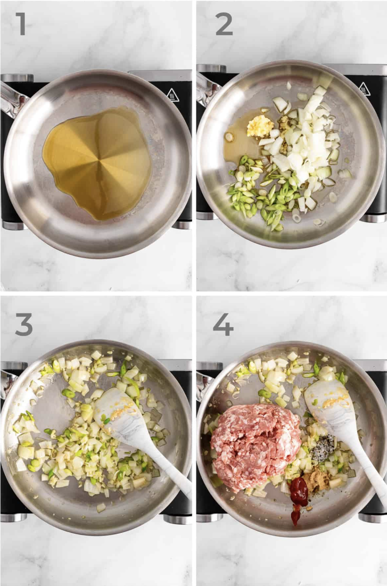
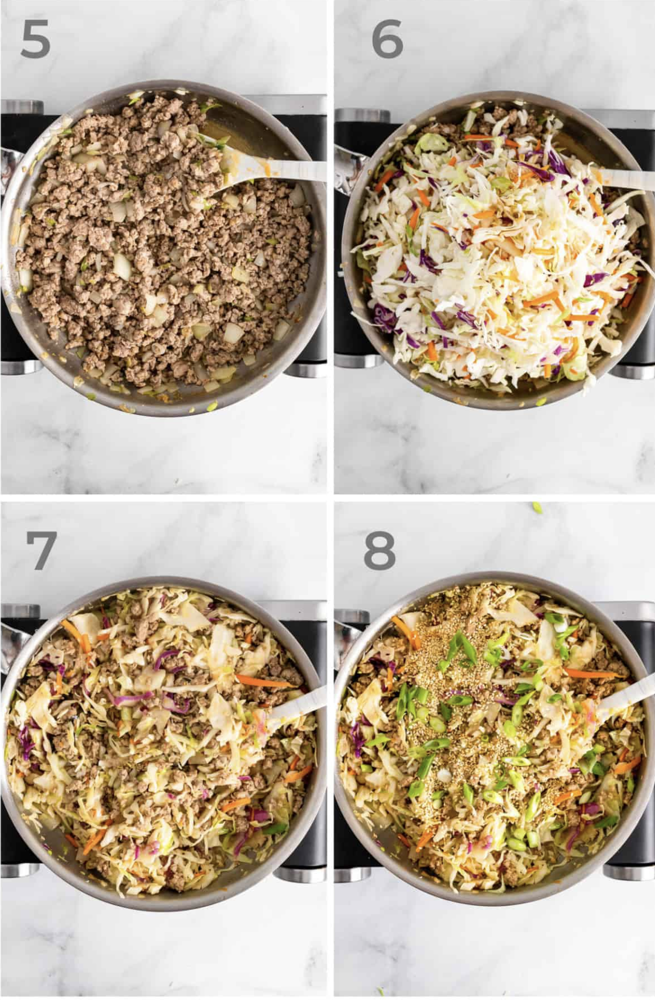

LOW CARB PORK EGG ROLL IN A BOWL (CRACK SLAW)

_**Keto Egg Roll in a Bowl** is the perfect quick and easy **one pot meal**. Juicy ground pork, hearty cabbage, onion, garlic and ginger, sautéed with toasted sesame oil, rice vinegar, and soy sauce, topped with green onions, sesame seeds and sriracha. Best if all it can be ready in **less than 30 minutes**. Take it to the next level by serving it with [Keto Yum Yum Sauce](https://peaceloveandlowcarb.com/keto-yum-yum-sauce/)_

## NOTES

## PREP

# INGREDIENTS

- **Ground pork** - This keto egg roll in a bowl recipe is made with ground pork, but it is also excellent with ground beef, ground sausage, ground turkey, or a combination of any of ground meats.
- **Soy sauce -** If you don't eat soy, coconut aminos is a great substitute for this pork egg roll in a bowl.
- **Sriracha -** This adds the perfect amount of heat. While sriracha really adds something special to this dish, it is still fantastic without it.
- **Rice vinegar -** make sure to use unseasoned rice vinegar to keep keto-friendly and sugar free. Seasoned rice vinegar has sugar added.
- **Toasted sesame oil -** this imparts a slight nuttiness to the flavor of the dish.
- **Ground ginger:** You can also use a teaspoon of fresh grated ginger.

# INSTRUCTIONS

## STEP BY STEP INSTRUCTIONS

**STEP 1:** Heat the sesame oil in a large skillet over medium high heat.  
  
**STEP 2:** Add the garlic, onion, and white portion of the green onions.  
  
**STEP 3:** Sauté until the onions are translucent and the garlic is fragrant.  
  
**STEP 4:** Add the ground pork, ginger, salt, pepper and Sriracha.

**STEP 5:** Sauté the pork until it is cooked through.  
  
**STEP 6:** Stir in the coleslaw mix, soy sauce, and rice vinegar.  
  
**STEP 7:** Sauté until the coleslaw is tender.  
  
**STEP 8:** Top with green onions and sesame seeds before serving.

## TIPS

- **Storage:** Store leftover low carb egg roll in a bowl in the fridge for up to 5 days. ([These are my favorite storage and meal prep containers](https://amzn.to/3vbp9hk))
- **Reheating:** I recommend reheating this in the microwave, or in a pan on the stove top.
- **Use broccoli slaw:** This keto egg roll in a bowl is also delicious with broccoli slaw in place of the coleslaw.
- Add noodles: Serve it with these [Sesame Ginger Noodles](https://peaceloveandlowcarb.com/sesame-ginger-noodles/), or just cook up some [shirataki noodles](https://amzn.to/3JTIqbt) in soy sauce, rice vinegar and sriracha.
- **Serve it on rice:** If you are not concerned with the carb count, this is delicious served on top of white rice. For a low carb rice option, serve it on top of this [Cilantro Lime Cauliflower Rice](https://hungryfoodie.com/cilantro-lime-cauliflower-rice/).

