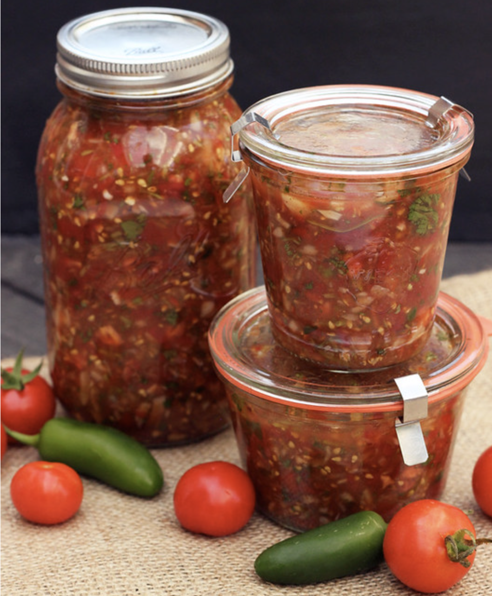

###### *RELATED* : 
---

---
## PREP | COMMENTS

---
# INGREDIENTS

- [ ] - 2 – 3 lbs of organic tomatoes of your choice, I used heirloom cherry tomatoes from my garden
- [ ] 1 large onion, I have used both red and white, both are delicious choices
- [ ] various, chile peppers – quantity and types, your choice. We like spicy so I went with 2 serrano and 1 jalapeño (you can also use bell peppers if you like your salsa mild)
- [ ] 3-4 garlic cloves, minced
- [ ] 1 bunch of fresh cilantro (If you don’t like cilantro add in oregano, chives, etc)
- [ ] Juice of 2 limes, or 1 lime and 1 lemon, or 2 lemons
- [ ] 1 1/2 – 2 tablespoons sea salt*
- [ ] Dried spices to taste, if you’d like – I added some cumin, chipotle and chile powder

---
# INSTRUCTIONS

1. Add the tomatoes to your food processor and pulse them a few times until they are broken down to the size you like. I prefer my salsa a tad chunky. Place the tomatoes in a large bowl. Add the roughly chopped onion, peppers, fresh herbs and dried spices to the food processor. Pulse a few times until everything is chopped to the size you like. Add these to the large bowl. Obviously if you don’t have a food processor, you can just chop all of this by hand.
2. Add the fresh squeezed lemon and/or lime juice and sea salt to the vegetables. (Add the whey now if you are using it.) Toss everything around until it is well mixed. Pour into quart sized or smaller clean mason jars. Leave some room at the top, don’t fill it all the way up. Cap tightly. Leave on the counter for 2 to 3 days. Transfer to the fridge or cold storage.

---
## NOTES

This salsa will keep up to a few months in the fridge. I have read up to 8 months, actually. The flavors will actually intensify over time.

* If you are using whey use only 1 tablespoon of sea salt and add 2 tablespoons of whey.

---
## TIPS

---
## NUTRITIONS

---
### *EXTRA* :

