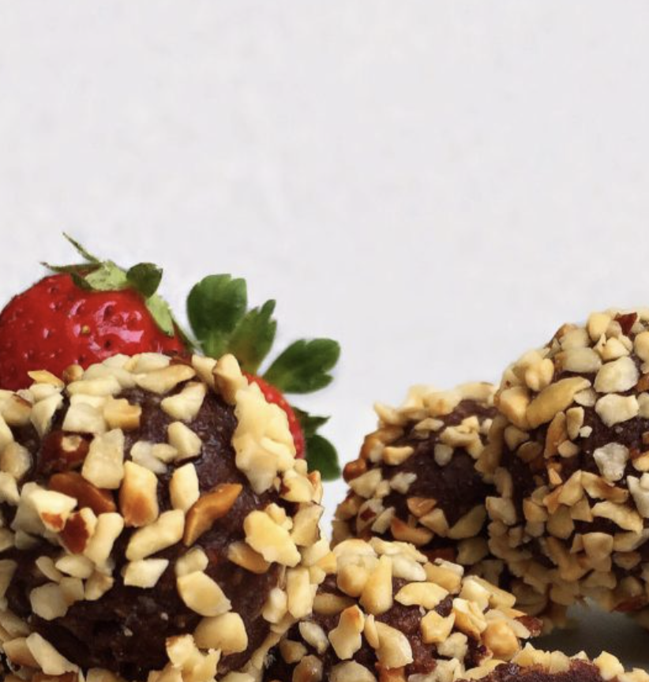

###### *RELATED* : 
---

---
## PREP | COMMENTS

- **Prep Time:**15 minutes
- **Cook Time:**30 minutes to freeze

---
# INGREDIENTS

- [ ] 150 grams or 2/3 cup roasted hazelnuts  
- [ ] 2 tablespoons raw cacao powder  
- [ ] 1 teaspoon of vanilla extract  
- [ ] 1/8 teaspoon sea salt  
- [ ] 3 tablespoons maple syrup  
- [ ] chopped hazelnuts (to garnish)

---
# INSTRUCTIONS

1. Add the hazelnuts into a food processor (keep aside 18 hazelnuts for the center) and blend until chopped into fine pieces.  
2. Add cacao, vanilla and salt and blend again.  
3. Add maple syrup and blend until the ingredients start to stick together, this can take a minute depending on the power of your food processor.  
4. Roll into small bite-sized balls, insert at the center one hazelnut, and roll over chopped hazelnuts to cover the balls.  
5.Place in the freezer for 30 minutes to harden.

---
## NOTES

---
## TIPS

---
## NUTRITIONS

Per Serving:  Calories: 79; Total Fat: 7g; Saturated Fat: 1g; Monounsaturated Fat: 1g; Polyunsaturated Fat: 0g; Cholesterol: 0mg; Sodium: 16mg; Potassium: 95mg; Carbohydrate: 5g; Fiber: 1g; Sugar: 2g; Protein: 2g

---
### *EXTRA* :

